# Benchmarks for (some) Range-Related Rust Crates

## Range-Related Rust Crates

Updated: *April 2025*

| Crate | # Downloads | Ranges | Element Type | Set Operations? | Internal | Maps, too? |
| --- | --- | --- | --- | --- | --- | --- |
|[range-set-blaze](https://github.com/CarlKCarlK/range-set-blaze) |  603,680 | Disjoint | Integer, char, IPv4, IPv6 | Set Ops | BTreeMap | Sets/Maps |
|[roaring](https://crates.io/crates/roaring) | 12,520,488 | Disjoint | u32 | SetOps | Compressed Bitmaps | Only Sets |
|[range-set](https://crates.io/crates/range-set) | 5,446,431 | Disjoint | PrimInt | No Set Ops | SmallVec | Only Sets |
|[rangemap](https://crates.io/crates/rangemap) | 5,285,903 | Disjoint | Ord | No Set Ops | BTreeMap | Sets/Maps |
|[range-collections](https://crates.io/crates/range-collections) | 565,520 | Disjoint | Ord | Set Ops | SmallVec | Sets |
|[sorted-iter](https://crates.io/crates/sorted-iter) | 326,742 | No | Ord | Set Ops | *n/a* | Sets/Maps |
|[iset](https://crates.io/crates/iset) | 333,454 | Overlapping | PartialOrd | No Set Ops | Red Black | Sets/Maps |
|[ranges](https://crates.io/crates/ranges) | 89,538 | Disjoint | 'Domain' | Set Ops | Vec | Only Sets |

> *The # of downloads as of April 2025*

## Benchmark Selection Criteria

I started by evaluating:

* `BTreeSet` and `HashSet` from the standard library
* `rangemap`, the most popular crate that works with ranges in a tree
* `range-collections` and `range-set`, the most popular crates that store ranges in a vector

I later added:

* `roaring`, a "compressed bitset" library with over a millions Rust downloads and versions in many other languages. It stores u32 values in 65K chunks of 65K values. Each chunk is represented as either a vector of integers, a vector of ranges, or a bitmap.

The `rangemap`, `range-collections`, `range-set`, and `roaring` crates store disjoint ranges. I eliminated crates that store overlapping ranges, a different data structure (for example, `iset`).

Disjoint ranges can be stored in a tree or a vector. With a tree, we expect inserts to be much faster than with a vector, O(ln *n*) vs O(*n*). Benchmark `ingest_clumps_easy` below showed this to be true. Because I care about such inserts, after that benchmark, I removed vector-based crates from consideration except for `roaring`.

Finally, I looked for crates that supported set operations (for example, union, intersection, set difference). Only `roaring` of the remaining crates offered set operations. (The inspirational `sorted-iter` also does, but it is designed to work on sorted values, not ranges, and so is not included.)

If I misunderstood any of the crates, please let me know. If you'd like to benchmark a crate, the benchmarking code is in the `benches` directory of this repository.

## Benchmark Results

These benchmarks allow us to understand the `range-set-blaze::RangeSetBlaze` data structure and to compare it to similar data structures from other crates.

## Benchmark #1: 'worst': Worst case for RangeSetBlaze

* **Measure**: intake speed
* **Candidates**: `HashSet`, `BTreeSet`, `Roaring`, `RangeSetBlaze`
* **Vary**: *n* from 1 to 10,000, number of random integers
* **Details**: Select *n* integers randomly and uniformly from the range 0..=999 (with replacement).

### 'worst' Results

`RangeSetBlaze` is consistently around 2.3 times slower than `BTreeSet` and `HashSet`. On small sets, `Roaring` is in the middle.

### 'worst' Conclusion

`BTreeSet` or `HashSet`, not `RangeSetBlaze`, is a good choice for ingesting sets of non-clumpy integers. However, `RangeSetBlaze` is not catastrophically bad; it is just on average 2.3 times worse. The
SIMD version of `RangeSetBlaze` is about 25% times slower than the non-SIMD version on this benchmark.

> See benchmark ['worst_op_blaze'](#benchmark-9-worst_op_blaze-compare-roaring-and-rangesetblaze-operators-on-uniform-data), near the end, for a similar comparison of set operations on uniform data.

*Lower is better*
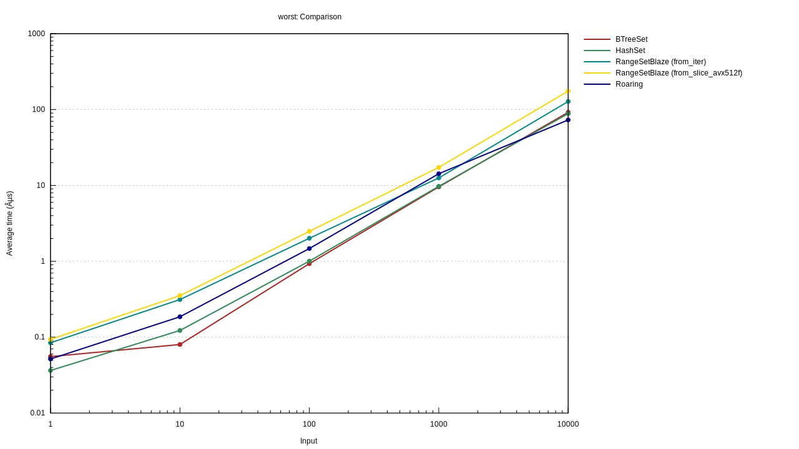

## Benchmark #2: 'ingest_clumps_base': Measure `RangeSetBlaze` on increasingly clumpy integers

* **Measure**: integer intake speed
* **Candidates**: `HashSet`, `BTreeSet`, `Roaring`, `RangeSetBlaze`
* **Vary**: *average clump size* from 1 (no clumps) to 100K (ten big clumps)
* **Details**: We generate 1M integers with clumps. We ingest the integers one at a time.
Each clump has size chosen uniformly random from roughly 1 to double *average clump size*. (The integer clumps are positioned random uniform, with-replacement, in a span from 0 to roughly 10M. The exact span is sized so that the union of the 1M integers will cover about 10% of the span. In other words, a given integer in the span will have a 10% chance of being in one of the 1M integers generated.)

### 'ingest_clumps_base' Results

With no clumps, `RangeSetBlaze` is 2.2 times slower than `HashSet`. Somewhere around clump size 3, `RangeSetBlaze` becomes the best performer. As the average clump size goes past 100, `RangeSetBlaze` averages about 25 times faster than `HashSet` and `BTreeSet`, and roughly 15 times faster than `Roaring`.

The nightly-only `RangeSetBlaze::from_slice` is even faster, as the clump size rises it is more than 100 times faster than the alternatives.

If we are allowed to input the clumps as ranges (instead of as individual integers), then when the average clump size is 1000 `RangeSetBlaze` is 1000
times faster than `HashSet` and `BTreeSet` and more than 30 times faster than `Roaring`.

### ingest_clumps_base' Conclusion

Range-based methods such as `RangeSetBlaze` and `Roaring` are a great choice for clumpy integers. When the input is given as ranges, they are the only sensible choice.

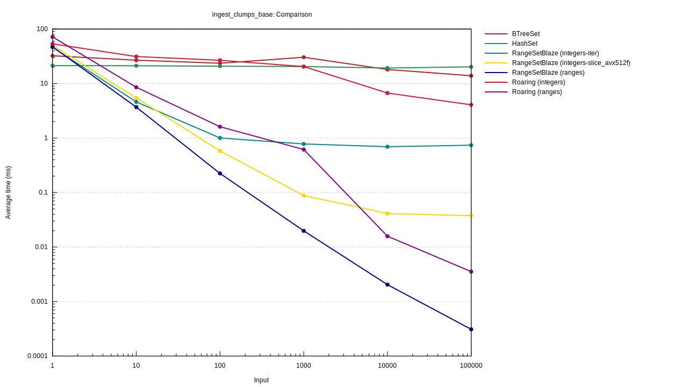

## Benchmark #3: 'ingest_clumps_integers': Measure the `rangemap` crate on clumpy integers

* **Measure**: integer intake speed
* **Candidates**: `base` + rangemap,
* **Vary**: *average clump size* from 1 (no clumps) to 100K (ten big clumps)
* **Details**: As with `base`.

We give each crate the clumps as individual integers.

### 'ingest_clumps_integers' Results & Conclusion

`rangemap` is typically three times slower than `HashSet` and 50 times slower than `RangeSetBlaze`. The nightly `RangeSetBlaze::from_slice` is even faster by an order of magnitude. However ...

`RangeSetBlaze` batches its integer input by noticing when consecutive integers fit in a clump. This batching is not implemented in `rangemap` but could easily be added to it or any other range-based crate.

`Roaring` is 5 to 25 times slower than `RangeSetBlaze`. I don't know if `Roaring` exploits consecutive integers. If not, it could.

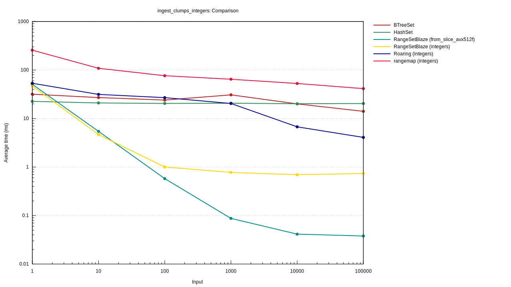

## Benchmark #4: 'ingest_clumps_ranges': Measure rangemap on ranges of clumpy integers

* **Measure**: range intake speed
* **Candidates**: RangeSetBlaze + rangemap + Roaring
* **Vary**: *average clump size* from 1 (no clumps) to 100K (ten big clumps)
* **Details**: As with `base`.

We give each crate the clumps as ranges (instead of as individual integers).

### 'ingest_clumps_ranges' Results & Conclusion

Over the clump sizes, `RangeSetBlaze` averages about 3 times faster than `rangemap` and 10 times faster than `Roaring`, However ...

`RangeSetBlaze` batches range inputs by sorting them and then merging adjacent ranges. This batching is likely not implemented in `rangemap` or `Roaring` but could easily be added to it or any other range-based crate.

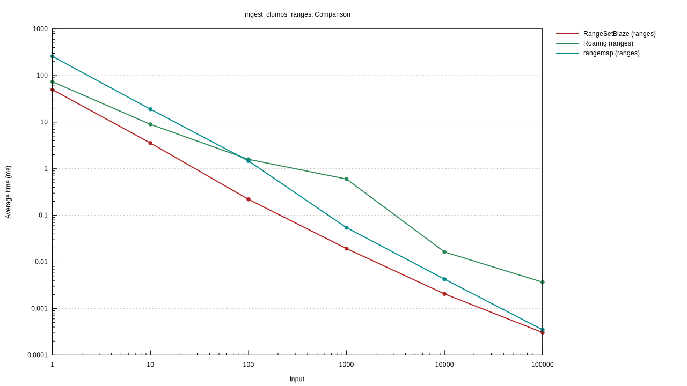

## Benchmark #5: 'ingest_clumps_easy': Measure various crates on (easier) ranges of clumpy integers

* **Measure**: range intake speed
* **Candidates**: Tree based (RangeSetBlaze rangemap), Vector based (`range_collections`, `range_set`), Compressed Bitsets (`Roaring`)
* **Vary**: *average clump size* from 1 (100K ranges) to 10 (10K ranges)
* **Details**: We generate 100K integers with clumps (down from 1M)

We give each crate the clumps as ranges (instead of as individual integers).

### 'ingest_clumps_easy' Results & Conclusion

The fastest vector-based method is 15 times slower than the slowest tree-based method. It is 75 times slower than `RangeSetBlaze`. This is expected because vector-based methods are not designed for a large numbers of inserts.

The hybrid method, `Roaring`, does better than any method except `RangeSetBlaze`.

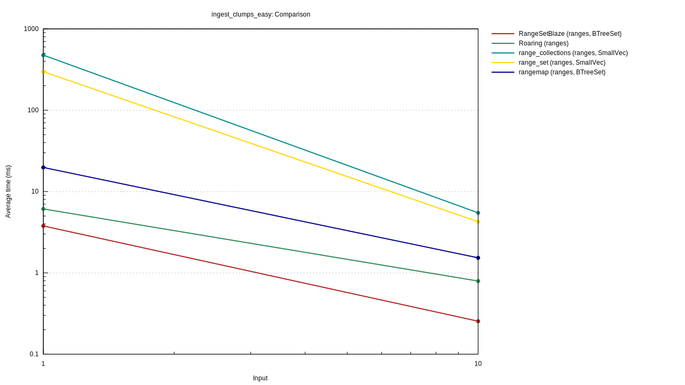

## Benchmark #6: 'union_two_sets': Union two sets of clumpy integers

* **Measure**: adding ranges to an existing set
* **Candidates**: RangeSetBlaze, rangemap, Roaring
* **Vary**: Number of clumps in the second set, from 1 to about 90K.
* **Details**: We first create two clump iterators, each with the desired number of clumps. Their integer span is 0..=99_999_999.
Each clump iterator is designed to cover about 10% of this span. We, next, turn these two iterators into two sets. The first set is made from 1000 clumps. Finally, we measure the time it takes to add the second set to the first set.

`RangeSetBlaze` uses a hybrid algorithm for "union". When adding a few ranges, it adds them one at a time. When adding many ranges, it
merges the two sets of ranges by iterating over them in sorted order and merging.

### 'union_two_sets' Results

When adding one clump to the first set, `RangeSetBlaze` is about 40% faster than `rangemap` and 50 times faster than `Roaring`.

As the number-of-clumps-to-add grows, `RangeSetBlaze` automatically switches algorithms. This allows it to be 6 times faster than the `rangemap`. `Roaring` and `RangeSetBlaze` use very similar `union` algorithms when the number of clumps is large and get similar results.

### union_two_sets' Conclusion

Over the whole range of clumpiness, `RangeSetBlaze` is faster because it uses a hybrid algorithm.

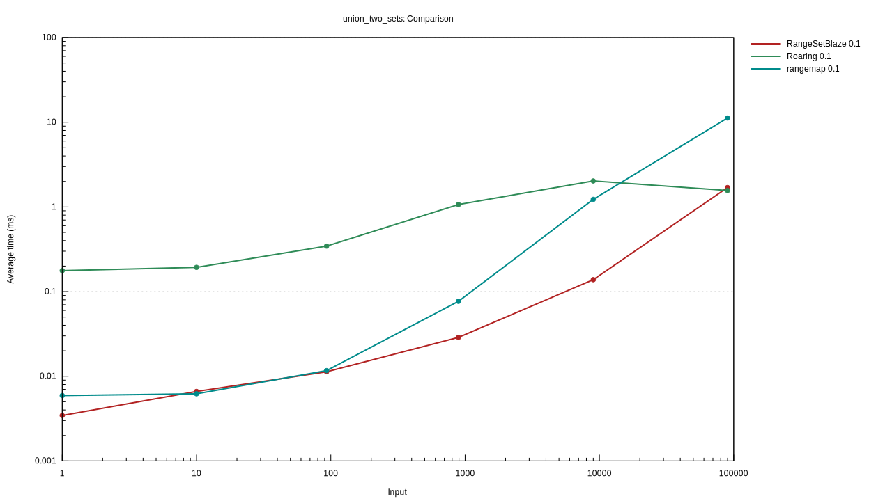

## Benchmark #7a: 'every_op_blaze': Compare `RangeSetBlaze`'s set operations to each other on clumpy data

* **Measure**: set operation speed
* **Candidates**: union, intersection, difference, symmetric_difference, complement
* **Vary**: number of ranges in the set, from 1 to about 50K.
* **Details**: We create two clump iterators, each with the desired number of clumps and a coverage of 0.5. Their span is 0..=99_999_999. We, next, turn these two iterators into two sets. Finally, we measure the time it takes to operate on the two sets.

### 'every_op_blaze' `RangeSetBlaze` Results and Conclusion

Complement (which works on just once set) is twice as fast as union, intersection, and difference. Symmetric difference is 1.7 times slower.

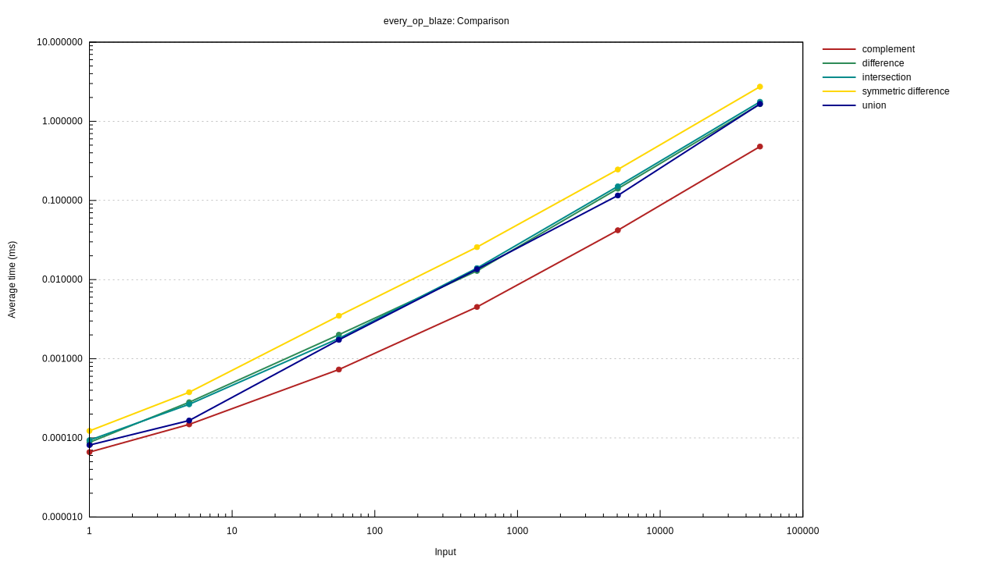

## Benchmark #7b: 'every_op_roaring': Compare `Roaring`'s set operations to each other on clumpy data

* *Set up same as in #7a*

### 'every_op_roaring' `Roaring` Results and Conclusion

Intersection is much faster than union. Complement is slowest because it is not defined by `Roaring` but can be defined by the user as `Universe - a_set`.

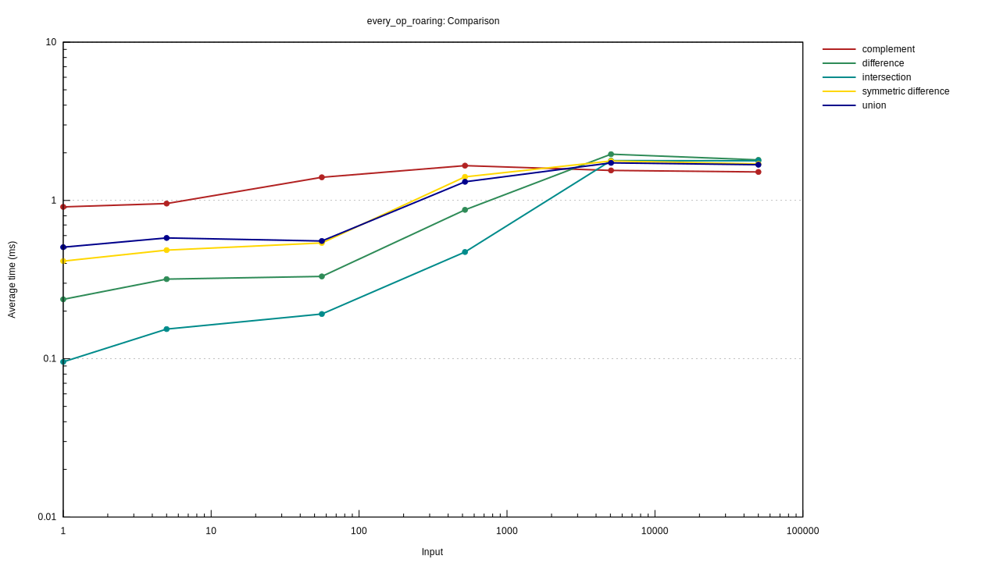

## Benchmark #7c: 'every_op': Compare `RangeSetBlaze and`Roaring`'s set operations on clumpy data

* *Set up same as in #7a*

### 'every_op' `RangeSetBlaze` and `Roaring` Results and Conclusion

When the number of ranges (or clumps) is very small, `RangeSetBlaze` operates on the data 1000's of times faster than `Roaring`. As the number of clumps goes into the 100's and 1000's, it is still 10 to 30 times faster. When the number of ranges get even larger, it is slightly faster.

The plot shows the results for intersection, `Roaring`'s fastest operator on this data.

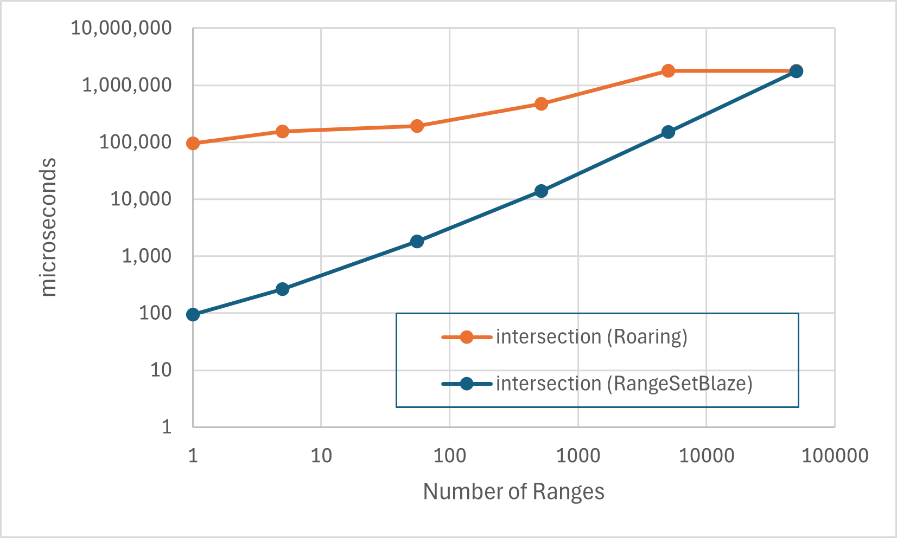

> See benchmark ['worst_op_blaze'](#benchmark-9-worst_op_blaze-compare-roaring-and-rangesetblaze-operators-on-uniform-data), near the end, for a similar comparison of set operations on uniform data.

## Benchmark #8: 'intersect_k_sets': `RangeSetBlaze` ` Multiway vs 2-at-time intersection

* **Measure**: intersection speed
* **Candidates**: 2-at-a-time intersection, multiway intersection (static and dynamic)
* **Vary**: number of sets, from 2 to 100.
* **Details**: We create *n* iterators. Each iterator generates 1,000 clumps. The iterators are designed such that the coverage of the final intersection is about 25%. The span of integers in the clumps is 0..=99_999_999. We turn the *n* iterators into *n* sets. Finally, we measure the time it takes to operate on the *n* sets.

### 'intersect_k_sets' Results and Conclusion

On two sets, all methods are similar but beyond that two-at-a-time gets slower and slower. For 100 sets, it must create about 100 intermediate sets and is about 10 times slower than multiway.

Dynamic multiway is not used by `RangeSetBlaze` but is sometimes needed by `SortedDisjoint` iterators
(also available from the `range-set-blaze` crate). It is 40% slower than static multiway.

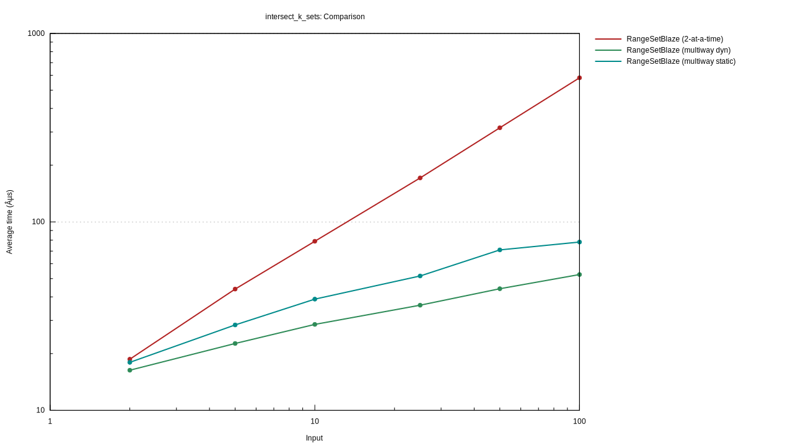

## Benchmark #9: 'worst_op_blaze': Compare `Roaring` and `RangeSetBlaze` operators on uniform data

* **Measure**: set intersection speed
* **Candidates**: `BTreeSet`, `HashSet`, `Roaring`, `RangeSetBlaze`
* **Vary**: *n* from 1 to 1M, number of random integers
* **Details**: Select *n* integers randomly and uniformly from the range 0..100,000 (with replacement). Create 20 pairs of set at each length.

### 'worst_op_blaze' Results and Conclusion

Over almost the whole range `Roaring` is best. Roughly 10 times better than `RangeSetBlaze` when the number of integers is less than 10,000. As the number of integers increases beyond 10,000 `RangeSetBlaze`, `BTreeSet`, and `HashSet` continue to get slower. `Roaring`, on the other hand, gets faster; presumably as it switches to bitmaps.

`Roaring` is a great choice when doing operations on u64 sets that may or may not be clumpy.

All four candidates offer similar interfaces. If you're not sure which is best for your application, you can easily swap between them and see.

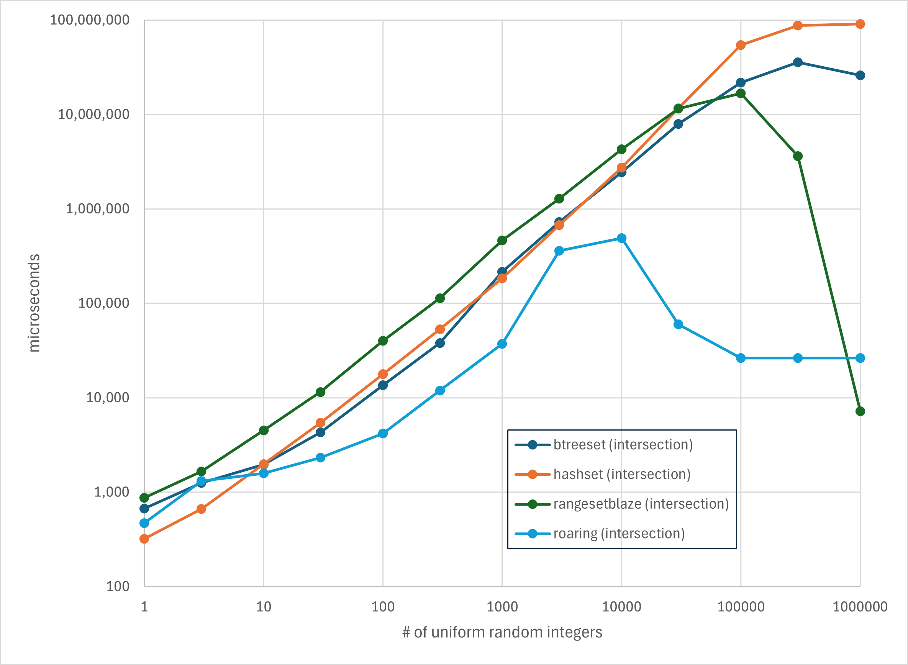
