# Benchmarks for (some) Range-Related Rust Crates (Sets only)

*For map-related benchmarks, see the [Benchmarks for Range-Related Rust Crates (Maps only)](bench_map.md) page.*

## Range-Related Rust Crates

Updated: *September 2026*

| Crate | # Downloads (all-time) | Ranges | Element Type | Set Operations? | Internal | Maps, too? |
| --- | --- | --- | --- | --- | --- | --- |
|[range-set-blaze](https://github.com/CarlKCarlK/range-set-blaze) | 5,379,999 | Disjoint | Integer, char, IPv4, IPv6¹ | Full set ops | BTreeMap | Sets/Maps |
|[roaring](https://crates.io/crates/roaring) | 49,778,997 | Disjoint / compressed | u32, u64² | Full set ops | Compressed Bitmaps | Only Sets |
|[rangemap](https://crates.io/crates/rangemap) | 35,175,172 | Disjoint | Ord | Union + intersection | BTreeMap | Sets/Maps |
|[range-set](https://crates.io/crates/range-set) | 11,351,001 | Disjoint | PrimInt | Union | SmallVec | Only Sets |
|[range-collections](https://crates.io/crates/range-collections) | 6,748,516 | Disjoint | Ord | Full set ops | SmallVec | Sets |
|[sorted-iter](https://crates.io/crates/sorted-iter) | 773,706 | No | Ord | Full set ops | *n/a* | Sets/Maps |
|[iset](https://crates.io/crates/iset) | 554,439 | Overlapping | PartialOrd | No set algebra | Red-black tree³ | Sets/Maps |
|[ranges](https://crates.io/crates/ranges) | 168,346 | Disjoint | 'Domain' | Full set ops | Vec | Only Sets |

> *Download counts are all-time totals from the crates.io API, as of September 2026.*
>
> ¹ `range-set-blaze` also has experimental floating-point support (`float_experimental` / `float_nightly_experimental` features), not listed above because it is feature-gated and not part of the crate's normal advertised element types.
> ² `RoaringBitmap` stores `u32`; `RoaringTreemap` stores `u64` as a tree of `RoaringBitmap` chunks.
> ³ Red-black tree with nodes stored in a vector.

## Benchmark Selection Criteria

I started by evaluating:

* `BTreeSet` and `HashSet` from the standard library
* `rangemap`, the most popular crate that works with ranges in a tree
* `range-collections` and `range-set`, the most popular crates that store ranges in a vector

I later added:

* `roaring`, a "compressed bitset" library with over a millions Rust downloads and versions in many other languages. It stores u32 values in 65K chunks of 65K values. Each chunk is represented as either a vector of integers, a vector of ranges, or a bitmap.

The `rangemap`, `range-collections`, `range-set`, and `roaring` crates store disjoint ranges. I eliminated crates that store overlapping ranges, a different data structure (for example, `iset`).

Disjoint ranges can be stored in a tree or a vector. With a tree, we expect inserts to be much faster than with a vector, O(ln *n*) vs O(*n*). Benchmark `ingest_clumps_easy` below showed this to be true. Because I care about such inserts, after that benchmark, I removed vector-based crates from consideration except for `roaring`.

Finally, I looked for crates that supported set operations (for example, union, intersection, set difference). Of the remaining crates, `roaring` offered the full set-operation algebra, so it became the operator benchmark's comparison point. (The inspirational `sorted-iter` also has full set ops, but it is designed to work on sorted values, not ranges, and so is not included.)

As of September 2026, `rangemap` has gained `union` and `intersection` methods (since v1.5.0), so it is now included in benchmarks #7a (`every_op_blaze`) and #7b (`every_op_roaring`) below for those two operations, even though it still lacks `difference`/`symmetric_difference`/`complement`.

If I misunderstood any of the crates, please let me know. If you'd like to benchmark a crate, the benchmarking code is in the `benches` directory of this repository.

## Benchmark Results

These benchmarks allow us to understand the `range-set-blaze::RangeSetBlaze` data structure and to compare it to similar data structures from other crates.

Benchmarks below (except #2b, which was already current) were re-run in September 2026 against updated crate versions: `rangemap` 1.7.1 → 1.8.0, `roaring` 0.10.12 → 0.11.5, and `range-set` 0.0.11 → 0.1.1 (`range-collections` 0.4.6 was already the latest release). No source changes were needed beyond bumping the `Cargo.toml` version requirements; the benchmark code compiled and ran unchanged against the new versions.

## Benchmark #1: 'worst': Worst case for RangeSetBlaze

* **Measure**: intake speed
* **Candidates**: `HashSet`, `BTreeSet`, `Roaring`, `RangeSetBlaze`
* **Vary**: *n* from 1 to 10,000, number of random integers
* **Details**: Select *n* integers randomly and uniformly from the range 0..=999 (with replacement).

### 'worst' Results

`RangeSetBlaze` is consistently slower than `BTreeSet` and `HashSet`, by roughly 1.5 to 4 times depending on *n* (geometric mean around 2×). On small sets, `Roaring` is in the middle.

### 'worst' Conclusion

`BTreeSet` or `HashSet`, not `RangeSetBlaze`, is a good choice for ingesting sets of non-clumpy integers. However, `RangeSetBlaze` is not catastrophically bad; it is just roughly 2 times worse on average. The SIMD version of `RangeSetBlaze` is about 20-35% slower than the non-SIMD version on this benchmark.

> See benchmark ['worst_op_blaze'](#benchmark-9-worst_op_blaze-compare-roaring-and-rangesetblaze-operators-on-uniform-data), near the end, for a similar comparison of set operations on uniform data.

*Lower is better in all plots*
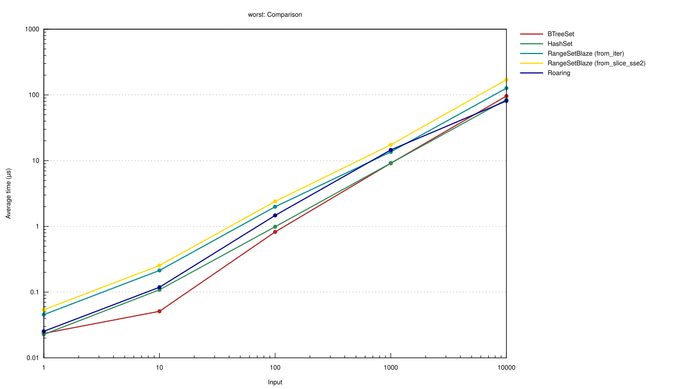

## Benchmark #2: 'ingest_clumps_base': Measure `RangeSetBlaze` on increasingly clumpy integers

* **Measure**: integer intake speed
* **Candidates**: `HashSet`, `BTreeSet`, `Roaring`, `RangeSetBlaze`
* **Vary**: *average clump size* from 1 (no clumps) to 100K (ten big clumps)
* **Details**: We generate 1M integers with clumps. We ingest the integers one at a time.
Each clump has size chosen uniformly random from roughly 1 to double *average clump size*. (The integer clumps are positioned random uniform, with-replacement, in a span from 0 to roughly 10M. The exact span is sized so that the union of the 1M integers will cover about 10% of the span. In other words, a given integer in the span will have a 10% chance of being in one of the 1M integers generated.)

### 'ingest_clumps_base' Results

With no clumps, `RangeSetBlaze` is about 2.5 times slower than `HashSet`. By clump size 10, `RangeSetBlaze` is already the best performer. As the average clump size goes past 1000, `RangeSetBlaze` is roughly 18 to 34 times faster than `HashSet` and `BTreeSet`, and roughly 5 to 21 times faster than `Roaring` (the exact ratio varies by clump size; see benchmark #3 for `Roaring`'s trend across the full range).

`RangeSetBlaze::from_slice` (SIMD-accelerated, stable Rust) is even faster: at the largest clump sizes tested it is more than 200 times faster than `HashSet`.

If we are allowed to input the clumps as ranges (instead of as individual integers, see benchmark #4), `RangeSetBlaze` is faster still — around 700 to 1300 times faster than `HashSet`/`BTreeSet` (ingesting integers one at a time) at clump size 1000. Compared directly against `Roaring` also given ranges, though, the two are much closer: `RangeSetBlaze` is only about 1.1 to 2.6 times faster (see benchmark #4).

### ingest_clumps_base' Conclusion

Range-based methods such as `RangeSetBlaze` and `Roaring` are a great choice for clumpy integers. When the input is given as ranges, they are the only sensible choice.

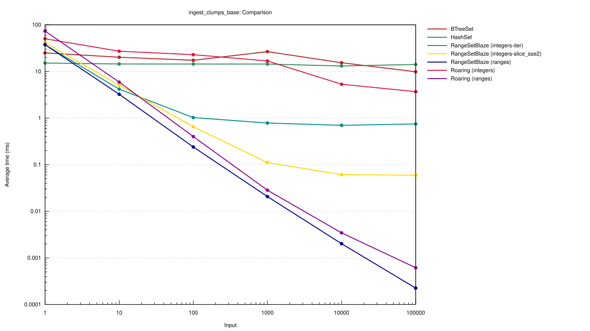

## Benchmark #2b: 'ingest_clumps_cursor': Experimental B-tree cursor insertion vs. the baseline algorithm

* **Measure**: integer intake speed, inserting one range at a time
* **Candidates**: `RangeSetBlaze` with its normal (baseline) insert algorithm vs. an experimental nightly-only insert algorithm built on Rust's unstable B-tree cursor API (`cursor_nightly_experimental` feature)
* **Vary**: *average clump size* from 1 (no clumps) to 100K (ten big clumps)
* **Details**: Same clump generation as `ingest_clumps_base`. We build a `RangeSetBlaze` by calling `ranges_insert` once per generated range. The baseline algorithm looks up the insertion point and then, separately, mutates the tree. The cursor algorithm does both in a single B-tree traversal using `BTreeMap`'s unstable cursor API (tracked in [rust-lang/rust#107540](https://github.com/rust-lang/rust/issues/107540)).

The cursor algorithm requires a nightly compiler. Both candidates run in the same process, via `range_set_blaze::test_util::{ranges_insert_baseline, ranges_insert_cursor}`, so they land in one plot from a single invocation:

```sh
cargo +nightly bench --bench bench --features cursor_nightly_experimental -- ingest_clumps_cursor
```

### 'ingest_clumps_cursor' Results

The cursor algorithm is faster than the baseline at every clump size tested, by roughly 1.8× to 2.2× (geometric mean about 2.0×):

| average clump size | baseline | cursor | speedup |
| ---: | ---: | ---: | ---: |
| 1 | 247 ms | 133 ms | 1.9× |
| 10 | 17.3 ms | 8.14 ms | 2.1× |
| 100 | 1.35 ms | 599 µs | 2.2× |
| 1,000 | 52.2 µs | 26.8 µs | 1.9× |
| 10,000 | 4.04 µs | 2.29 µs | 1.8× |
| 100,000 | 339 ns | 174 ns | 1.9× |

Unlike `ingest_clumps_base`, the speedup here is roughly constant across clump sizes rather than growing with clumpiness — the cursor algorithm saves a redundant tree traversal on every insert, a fixed-fraction win regardless of how many elements each clump merges.

**Isolating the compiler from the algorithm.** Because the cursor API is nightly-only, both rows in the table above were compiled and measured under the nightly toolchain, in the same process — so the baseline-vs-cursor comparison is already apples-to-apples on the compiler. To double check that nightly itself isn't what's driving the speedup (rather than the cursor algorithm), we separately compiled and ran just the baseline candidate under the normal **stable** toolchain (`cargo bench -- ingest_clumps_cursor`, no `cursor_nightly_experimental` feature):

| average clump size | baseline (stable) | baseline (nightly) | cursor (nightly) | speedup, cursor vs. stable baseline |
| ---: | ---: | ---: | ---: | ---: |
| 1 | 283 ms | 247 ms | 133 ms | 2.1× |
| 10 | 17.1 ms | 17.3 ms | 8.14 ms | 2.1× |
| 100 | 1.32 ms | 1.35 ms | 599 µs | 2.2× |
| 1,000 | 47.9 µs | 52.2 µs | 26.8 µs | 1.8× |
| 10,000 | 3.74 µs | 4.04 µs | 2.29 µs | 1.6× |
| 100,000 | 305 ns | 339 ns | 174 ns | 1.8× |

The stable-compiled baseline is close to the nightly-compiled baseline at every clump size (within about 15%, and the direction isn't even consistent — stable is slightly slower at clump size 1 but faster at larger sizes), and the cursor-vs-stable-baseline speedup (geometric mean ≈1.9×) is essentially the same as the cursor-vs-nightly-baseline speedup reported above (≈2.0×). This confirms the speedup is coming from the cursor algorithm itself, not from nightly codegen.

### 'ingest_clumps_cursor' Conclusion

The B-tree cursor insertion algorithm is a consistent, unconditional win over the baseline for single-range inserts. It is still experimental and nightly-only pending stabilization of the cursor API, but the results support moving toward making it the default once that API stabilizes.

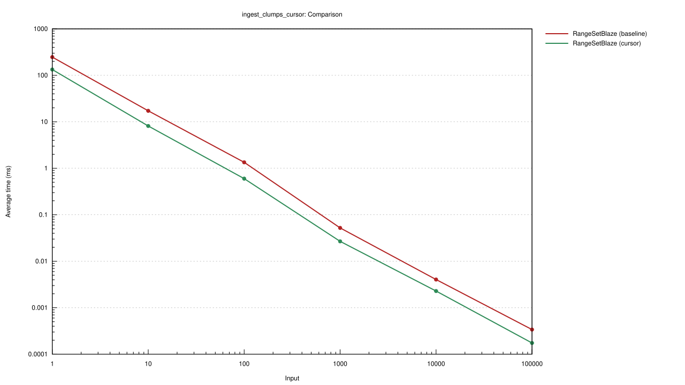

## Benchmark #3: 'ingest_clumps_integers': Measure the `rangemap` crate on clumpy integers

* **Measure**: integer intake speed
* **Candidates**: `base` + rangemap,
* **Vary**: *average clump size* from 1 (no clumps) to 100K (ten big clumps)
* **Details**: As with `base`.

We give each crate the clumps as individual integers.

### 'ingest_clumps_integers' Results & Conclusion

`rangemap` is 2 to 16 times slower than `HashSet`, and the gap is largest for small clumps (near-uniform data) and narrows as clumps get bigger. It is 7 to 46 times slower than `RangeSetBlaze`, again widest at large clump sizes. `RangeSetBlaze::from_slice` (SIMD-accelerated, stable Rust) is even faster by an order of magnitude. However ...

`RangeSetBlaze` batches its integer input by noticing when consecutive integers fit in a clump. This batching is not implemented in `rangemap` but could easily be added to it or any other range-based crate. However, however, ...

We'll see in the next benchmark that this is not the whole story.

`Roaring` is 1.3 to 22 times slower than `RangeSetBlaze`, with the gap narrowest for small clumps (near-uniform data). I don't know if `Roaring` exploits consecutive integers. If not, it could.

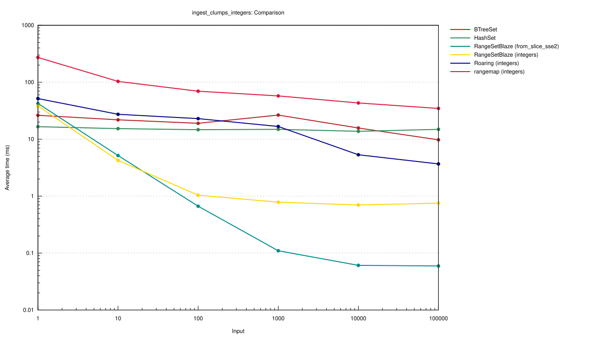

## Benchmark #4: 'ingest_clumps_ranges': Measure rangemap on ranges of clumpy integers

* **Measure**: range intake speed
* **Candidates**: RangeSetBlaze + rangemap + Roaring
* **Vary**: *average clump size* from 1 (no clumps) to 100K (ten big clumps)
* **Details**: As with `base`.

We give each crate the clumps as ranges (instead of as individual integers).

### 'ingest_clumps_ranges' Results & Conclusion

Although `RangeSetBlaze`, `rangemap`, and `RoaringBitmap` all represent sets of integers, their internal designs lead to clear performance differences:

* **`RangeSetBlaze`** is roughly 3× faster than `rangemap` (geometric mean across clump sizes; the per-size ratio ranges from about 1.1× to 6.3×) in these benchmarks. Even when the ranges are uncorrelated—so batching doesn't help—it still leads. That’s because it uses a `BTreeMap` with **set-specific logic**, avoiding all value-handling overhead.

* **`rangemap`** represents sets as `RangeMap<K, ()>`. While functional, this introduces unnecessary comparisons and merging of unit values. The upside is **simpler, shared code** between maps and sets.

* **`RoaringBitmap`** uses **run-length encoding (RLE)** internally—effectively a form of range representation. However, it stores these runs in **vectors**, which have slower insertion performance than the `BTreeMap` structures used by the other two. This makes `roaring` slower in workloads with frequent inserts or non-clumpy data. As of `roaring` 0.11.5, this gap has narrowed substantially since our last measurement: `RangeSetBlaze` is now only about 1.1× to 2.6× faster than `roaring` here (previously closer to 10×), suggesting `roaring`'s insertion path has improved.

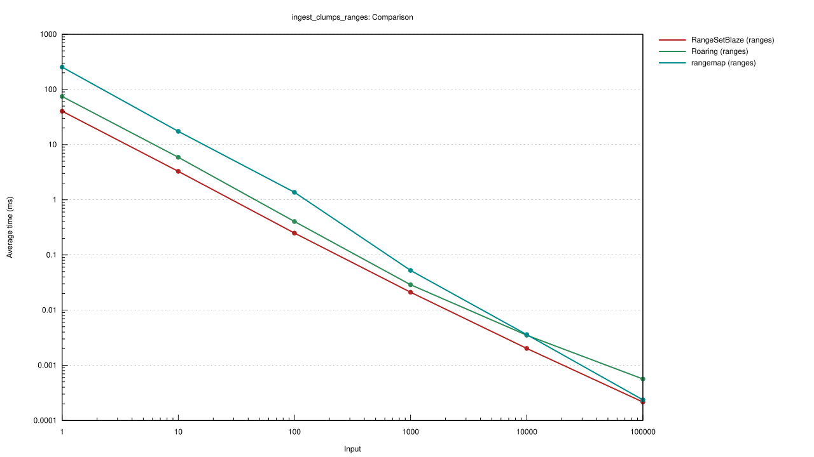

## Benchmark #5: 'ingest_clumps_easy': Measure various crates on (easier) ranges of clumpy integers

* **Measure**: range intake speed
* **Candidates**: Tree based (RangeSetBlaze, rangemap), Vector based (`range_collections`, `range_set`), Compressed Bitsets (`Roaring`)
* **Vary**: *average clump size* from 1 (100K ranges) to 10 (10K ranges)
* **Details**: We generate 100K integers with clumps (down from 1M)

We give each crate the clumps as ranges (instead of as individual integers).

### 'ingest_clumps_easy' Results & Conclusion

The fastest vector-based method is 2 to 11 times slower than the slowest tree-based method, and 11 to 59 times slower than `RangeSetBlaze` (the gap is largest at the smallest average clump size tested). This is expected because vector-based methods are not designed for large numbers of inserts.

The hybrid method, `Roaring`, does better than any method except `RangeSetBlaze`.

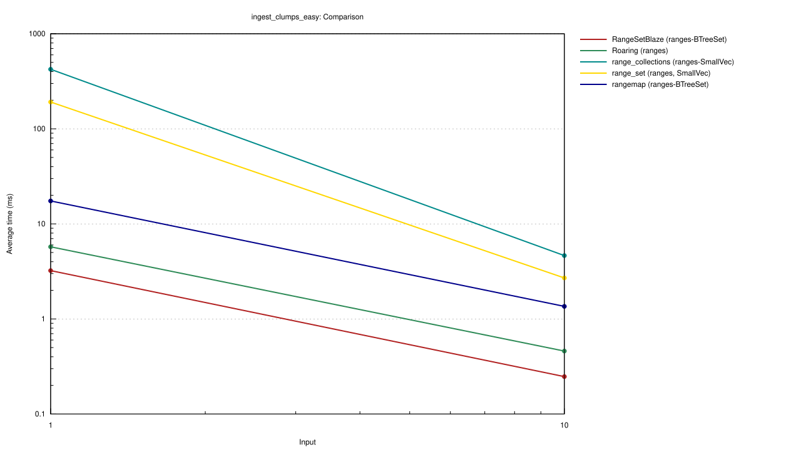

## Benchmark #6: 'union_two_sets': Union two sets of clumpy integers

* **Measure**: adding ranges to an existing set
* **Candidates**: RangeSetBlaze, rangemap, Roaring
* **Vary**: Number of clumps in the second set, from 1 to about 90K.
* **Details**: We first create two clump iterators, each with the desired number of clumps. Their integer span is 0..=99_999_999. Each clump iterator is designed to cover about 10% of this span. We, next, turn these two iterators into two sets. The first set is made from 1000 clumps. Finally, we measure the time it takes to add the second set to the first set.

`RangeSetBlaze` uses a hybrid algorithm for "union". When adding a few ranges, it adds them one at a time. When adding many ranges, it merges the two sets of ranges by iterating over them in sorted order and merging. When the second set is relatively large and owned, it adds ranges from the first set--one at a time--to the second set and then moves the result into the first set.

### 'union_two_sets' Results

When adding one clump to the first set, `RangeSetBlaze` is about 60% faster than `rangemap` and 40 times faster than `Roaring`.

As the number-of-clumps-to-add grows, `RangeSetBlaze` automatically switches algorithms. This allows it to be about 6 times faster than `rangemap` at the largest clump counts tested. `Roaring` and `RangeSetBlaze` use very similar `union` algorithms when the number of clumps is large and get similar results (within about 15% of each other).

### union_two_sets' Conclusion

Over the whole range of clumpiness, `RangeSetBlaze` is faster because it uses a hybrid algorithm.

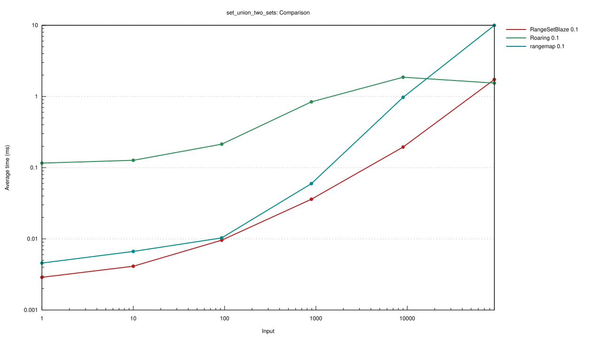

## Benchmark #7a: 'every_op_blaze': Compare `RangeSetBlaze`'s set operations to each other (and to `rangemap`) on clumpy data

* **Measure**: set operation speed
* **Candidates**: union, intersection, difference, symmetric_difference, complement (all `RangeSetBlaze`); union, intersection (also `rangemap`, which is the only other candidate crate here that offers any set-operation algebra — see the [Benchmark Selection Criteria](#benchmark-selection-criteria) above)
* **Vary**: number of ranges in the set, from 1 to about 50K.
* **Details**: We create two clump iterators, each with the desired number of clumps and a coverage of 0.5. Their span is 0..=99_999_999. We, next, turn these two iterators into two sets. Finally, we measure the time it takes to operate on the two sets. For `rangemap`, the same two `RangeSetBlaze` sets are converted (once, outside the timed portion) into `rangemap::RangeInclusiveSet`, and `union`/`intersection` are measured via `&a | &b` / `&a & &b`.

### 'every_op_blaze' `RangeSetBlaze` Results and Conclusion

Complement (which works on just one set) is 4 to 5 times as fast as union, intersection, and difference. Symmetric difference is about 1.6 to 1.7 times slower than union/intersection/difference.

`rangemap`'s `union`/`intersection` are competitive with (even very slightly faster than) `RangeSetBlaze`'s at the smallest sizes tested (1 to 5 ranges per set), but `RangeSetBlaze` pulls steadily ahead as the sets grow, ending up roughly 4 times faster than `rangemap` at the largest size tested (about 50K ranges per set), for both union and intersection.

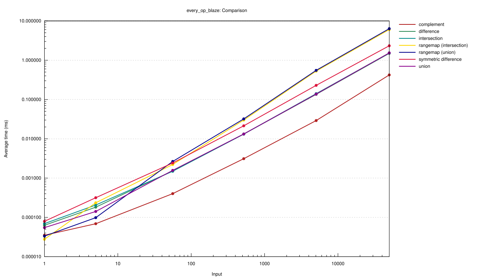

## Benchmark #7b: 'every_op_roaring': Compare `Roaring`'s set operations to each other (and to `rangemap`) on clumpy data

* *Set up same as in #7a, plus `rangemap` union/intersection compared against `Roaring`'s (see #7a for how the `rangemap` sets are built)*

### 'every_op_roaring' `Roaring` Results and Conclusion

Intersection is faster than union at small clump counts (up to about 4× faster), but the gap narrows steadily and nearly disappears by the largest clump count tested. Complement's relative speed varies with clump count — it is sometimes the *fastest* operation at small clump counts, but becomes the slowest by the largest clump count tested, consistent with it not being a native `Roaring` operation (it is defined by the user as `Universe - a_set`).

The `rangemap` comparison produced the most dramatic result in this whole document: at small clump counts, `rangemap`'s `union`/`intersection` are *four to five orders of magnitude* faster than `Roaring`'s (e.g. at 1 range per set, `rangemap` union takes ~32 ns versus `Roaring`'s ~4.5 ms). This is because `Roaring`'s bitmap-oriented representation carries meaningful fixed overhead per operation regardless of how little data is in the set, while `rangemap`'s tree of ranges has essentially none for tiny inputs. `rangemap` stays faster than `Roaring` up through several thousand ranges per set, but the two cross over somewhere between about 5,000 and 50,000 ranges per set — by the largest size tested (about 50K ranges), `Roaring` is roughly 4 times faster than `rangemap` for both operations. In short: for small-to-medium range counts, `rangemap` beats `Roaring` on union/intersection by a huge margin; `Roaring` only wins once the sets get large.

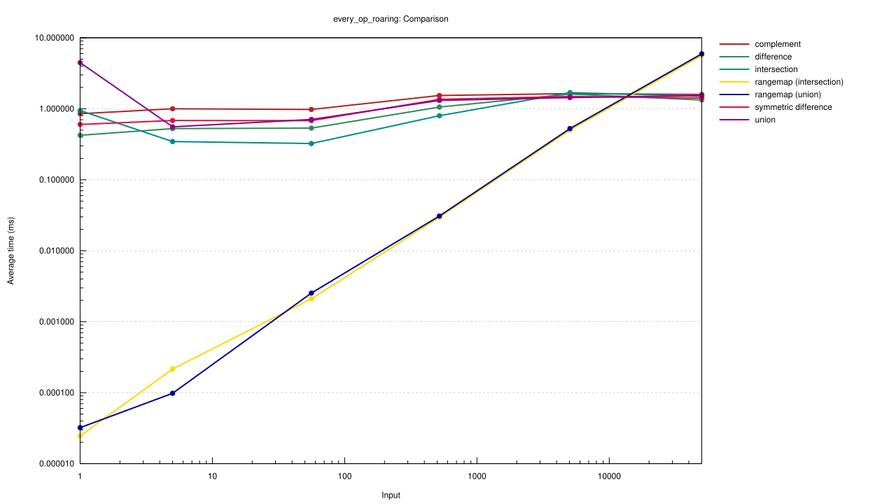

## Benchmark #7c: 'every_op': Compare `RangeSetBlaze and`Roaring`'s set operations on clumpy data

* *Set up same as in #7a*

### 'every_op' `RangeSetBlaze` and `Roaring` Results and Conclusion

When the number of ranges (or clumps) is very small, `RangeSetBlaze` operates on the data thousands of times faster than `Roaring`. As the number of clumps goes into the hundreds and low thousands, it is still roughly 10 to 900 times faster. At the largest clump counts tested, the two are roughly comparable — `RangeSetBlaze` is no longer clearly ahead, and `Roaring` may be marginally faster.

The plot shows the results for intersection, `Roaring`'s fastest operator on this data.

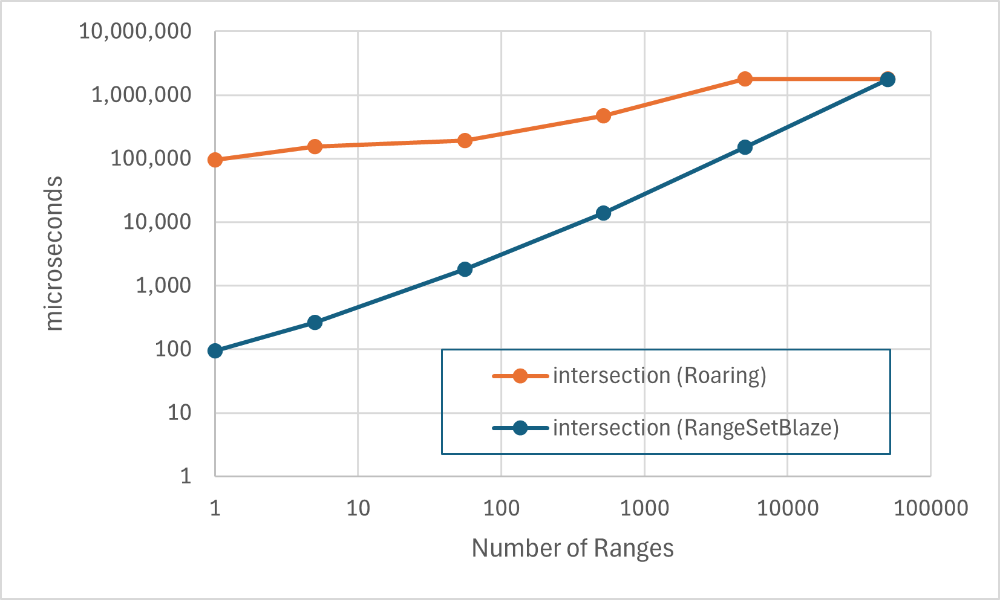

> See benchmark ['worst_op_blaze'](#benchmark-9-worst_op_blaze-compare-roaring-and-rangesetblaze-operators-on-uniform-data), near the end, for a similar comparison of set operations on uniform data.

## Benchmark #8: 'intersect_k_sets': `RangeSetBlaze` ` Multiway vs 2-at-time intersection

* **Measure**: intersection speed
* **Candidates**: 2-at-a-time intersection, multiway intersection (static and dynamic)
* **Vary**: number of sets, from 2 to 100.
* **Details**: We create *n* iterators. Each iterator generates 1,000 clumps. The iterators are designed such that the coverage of the final intersection is about 25%. The span of integers in the clumps is 0..=99_999_999. We turn the *n* iterators into *n* sets. Finally, we measure the time it takes to operate on the *n* sets.

### 'intersect_k_sets' Results and Conclusion

On two sets, all methods are similar but beyond that two-at-a-time gets slower and slower. For 100 sets, it must create about 100 intermediate sets and is about 12 times slower than multiway.

Dynamic multiway is not used by `RangeSetBlaze` but is sometimes needed by `SortedDisjoint` iterators
(also available from the `range-set-blaze` crate). Its overhead over static multiway shrinks as the number of sets grows — from about 40% slower at 2 sets down to about 10% slower at 100 sets.

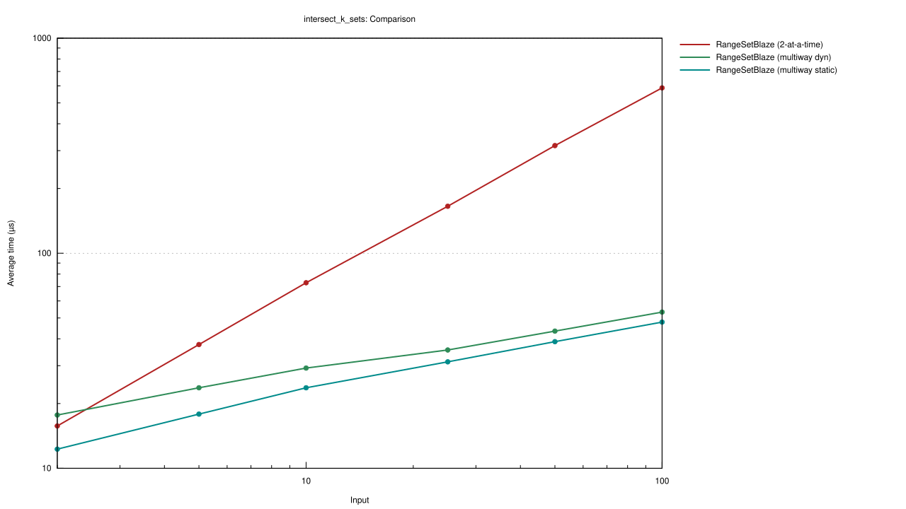

## Benchmark #9: 'worst_op_blaze': Compare `Roaring` and `RangeSetBlaze` operators on uniform data

* **Measure**: set intersection speed
* **Candidates**: `BTreeSet`, `HashSet`, `Roaring`, `RangeSetBlaze`
* **Vary**: *n* from 1 to 1M, number of random integers
* **Details**: Select *n* integers randomly and uniformly from the range 0..100,000 (with replacement). Create 20 pairs of sets at each length.

### 'worst_op_blaze' Results and Conclusion

Over almost the whole range `Roaring` is best — roughly 2 to 9 times faster than `RangeSetBlaze` while the number of integers is 100,000 or fewer. As the number of integers increases beyond 10,000, `BTreeSet` and `HashSet` continue to get slower, while `Roaring` gets dramatically faster (by two orders of magnitude by n = 100,000), presumably as it switches to bitmaps.

`RangeSetBlaze` shows a striking non-monotonic pattern worth calling out: it gets slower as n grows up to 100,000 (matching the size of the sampled domain, 0..100,000), then gets *dramatically* faster at n = 300,000 and n = 1,000,000 — by roughly 3 orders of magnitude, ending up faster than `BTreeSet`/`HashSet` and within a small factor of `Roaring`. This makes sense given how sets are generated: once n exceeds the domain size, with-replacement sampling means both sets saturate almost the entire 0..100,000 domain, so each collapses to just a handful of ranges and the intersection becomes nearly free. `BTreeSet` and `HashSet` don't get this benefit because they store every element regardless of how saturated the domain becomes.

`Roaring` is a great choice when doing operations on u64 sets that may or may not be clumpy.

All four candidates offer similar interfaces. If you're not sure which is best for your application, you can easily swap between them and see.

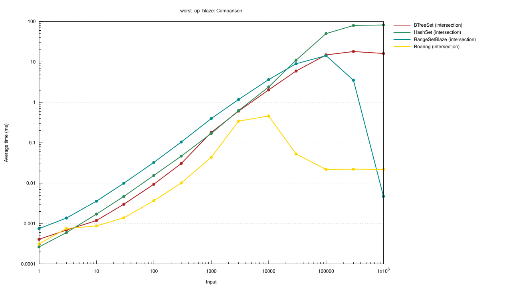
