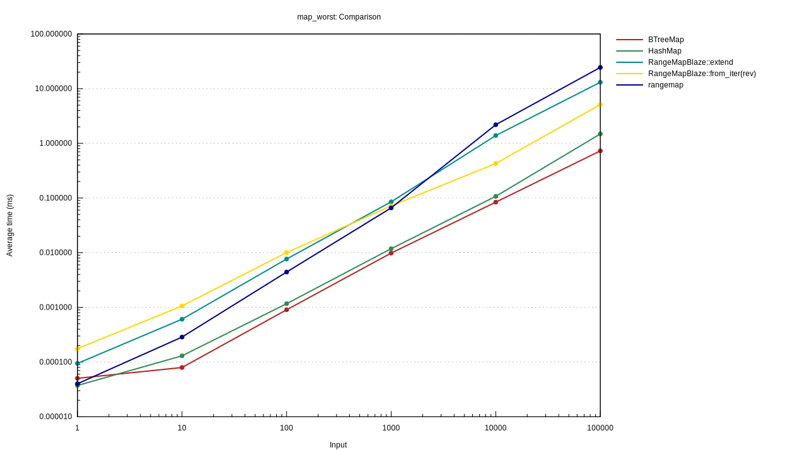
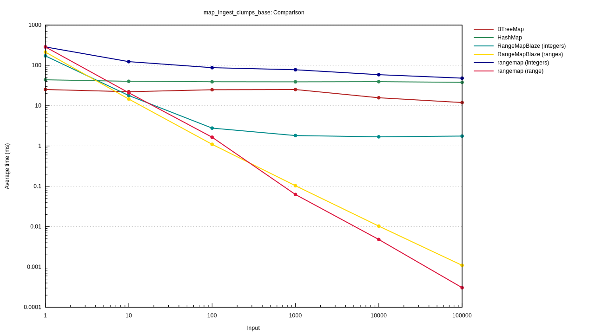
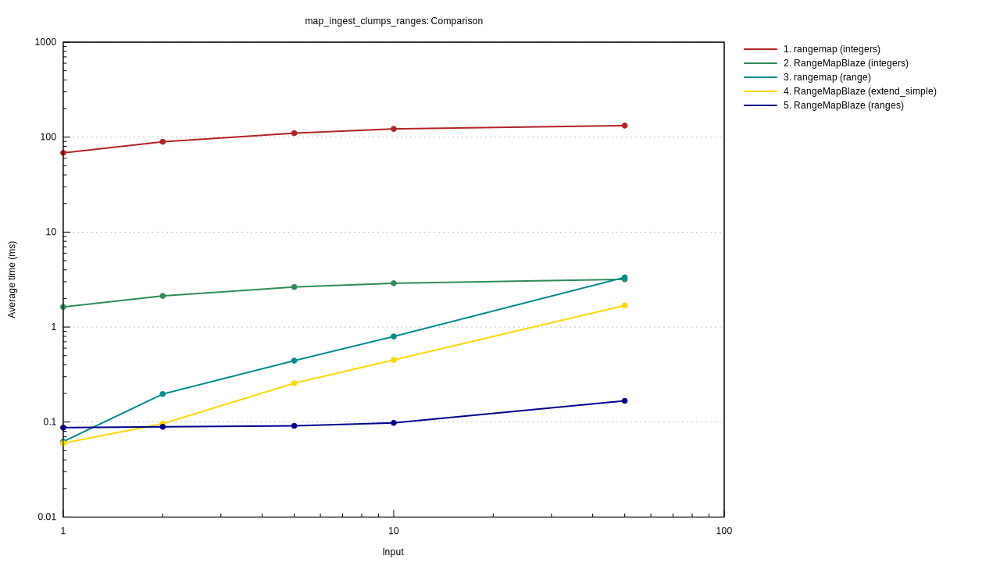
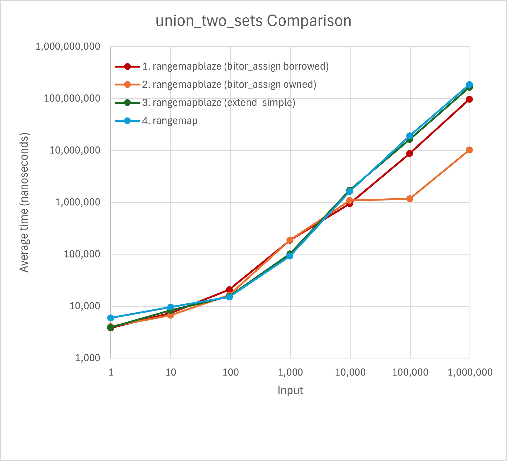
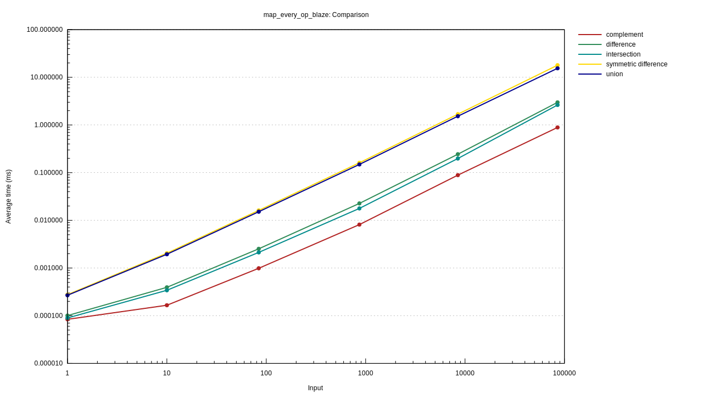
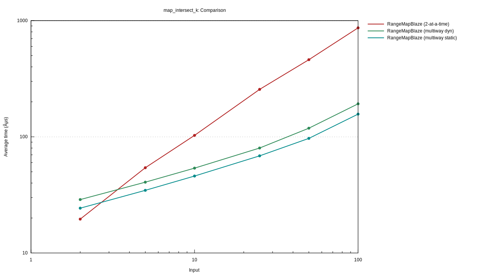

# Benchmarks for (some) Range-Related Rust Crates (Maps only)

## Range-Related Rust Crates (Maps only)

Updated: *April 2025*

| Crate | # Downloads | Ranges | Element Type | Set Operations? | Internal | Maps, too? |
| --- | --- | --- | --- | --- | --- | --- |
|[range-set-blaze](https://github.com/CarlKCarlK/range-set-blaze) |  603,680 | Disjoint | Integer, char, IPv4, IPv6 | Set Ops | BTreeMap | Sets/Maps |
|[rangemap](https://crates.io/crates/rangemap) | 5,285,903 | Disjoint | Ord | No Set Ops | BTreeMap | Sets/Maps |
|[sorted-iter](https://crates.io/crates/sorted-iter) | 326,742 | No | Ord | Set Ops | *n/a* | Sets/Maps |
|[iset](https://crates.io/crates/iset) | 333,454 | Overlapping | PartialOrd | No Set Ops | Red Black | Sets/Maps |

> *The # of downloads as of April 2025*

## Benchmark Selection Criteria

I evaluated:

* `BTreeMap` and
* `HashMap` from the standard library, and
* `rangemap`, the most popular crate that works with ranges in a tree.

The `rangemap` crate stores disjoint ranges. I eliminated crates that store overlapping ranges, a different data structure (for example, `iset`).

Finally, I looked for crates that supported set operations (for example, union, intersection, set difference). None of the remaining crates offered set operations. (The inspirational `sorted-iter` also does, but it is designed to work on sorted values, not ranges, and so is not included.)

If I misunderstood any of the crates, please let me know. If you'd like to benchmark a crate, the benchmarking code is in the `benches` directory of this repository.

## Benchmark Results

These benchmarks allow us to understand the `range-set-blaze::RangeMapBlaze` data structure and to compare it to similar data structures from other crates.

## Benchmark #1: 'map_worst': Worst case for RangeMapBlaze

* **Measurement**: Intake (insertion) speed
* **Competitors**: `HashSet`, `BTreeSet`, `rangemap`, `RangeMapBlaze`
* **Variation**: Number of key-value pairs (*n*) from 1 to 10,000
* **Setup**:
  * Randomly and uniformly select *n* keys from 0..=999 (with replacement).
  * Randomly and uniformly select *n* values from 0..=4 (with replacement)

### 'map_worst' Results

`BTreeSet` and `HashSet` are the fastest. `RangeMapBlaze` is consistently around 7 to 10 times slower.
`rangemap` varies from fastest to slowest depending on the number of pairs.

### 'map_worst' Conclusion

`BTreeSet` or `HashSet`, not `RangeMapBlaze` (nor `rangemap`), is a good choice for ingesting sets of non-clumpy integers. However, `RangeMapBlaze` is consistently on average 10 times worse.

*Lower is better*

## Benchmark #2: 'map_ingest_clumps_base': Measure `RangeMapBlaze` on increasingly clumpy integer keys

* **Measure**: integer-integer pair intake speed
* **Candidates**: `HashSet`, `BTreeSet`, `rangemap`, `RangeMapBlaze`
* **Vary**: *average clump size* from 1 (no clumps) to 100K (ten big clumps)
* **Details**: We generate 1M integer keys with clumps. We ingest the integer pairs one at a time.
Each clump has size chosen uniformly random from roughly 1 to double *average clump size*. (The integer clumps are positioned random uniform, with-replacement, in a span from 0 to roughly 10M. The exact span is sized so that the union of the 1M integers will cover about 10% of the span. In other words, a given integer key in the span will have a 10% chance of being in one of the 1M integers generated.)

The value for each clump is a random integer from 0 to 4.

Where applicable, we also test ingesting range-integer pairs where each original clump is split randomly into five overlapping ranges. All five
ranges have the same value.

### 'map_ingest_clumps_base' Results

With no clumps, `RangeMapBlaze (integers)` is 6.6 times slower than `BTreeMap`. Somewhere around clump size 8, `RangeMapBlaze` becomes the best integer
performer. As the average clump size goes past 100, `RangeMapBlaze` averages about 89 times faster than `HashSet` and `BTreeSet`, and roughly 35 times faster than `rangemap (integers)`.

`RangeSetBlaze` batches integer keys with the same value by noticing when consecutive integers fit in a clump. This batching is not implemented in `rangemap` but could easily be added to it or any other range-based crate.

### ingest_clumps_base' Conclusion

Range-based methods such as `RangeMapBlaze` is a great choice for clumpy integer keys.

*Lower is better*

## Benchmark #3: 'map_ingest_clumps_ranges': Measure `RangeMapBlaze` on increasingly clumpy ranges keys

* **Measure**: range-integer pair intake speed
* **Candidates**: `HashSet`, `BTreeSet`, `rangemap`, `RangeMapBlaze`
* **Vary**: *ranges_per_clump* from 1 (ranges are not clumpy) to 50 (ranges are very clumpy).
* **Details**: We generate 1M integer keys in 1000 clumps. We then divide each clump into *ranges_per_clump* overlapping ranges. Each range has the same value.  We ingest the range-value pairs.
Each clump has size chosen uniformly random from roughly 1 to double *average clump size*. (The integer clumps are positioned random uniform, with-replacement, in a span from 0 to roughly 10M. The exact span is sized so that the union of the 1M integers will cover about 10% of the span. In other words, a given integer key in the span will have a 10% chance of being in one of the 1M integers generated.)
Clumps are turned into *ranges_per_clump* overlapping ranges randomly.

The value for each clump is a random integer from 0 to 4.

### 'map_ingest_clumps_ranges' Results

When ranges are not clumpy (`ranges_per_clump` = 1), `rangemap` and `RangeMapBlaze::extend_simple` are the fastest, but as soon
as two consecutive ranges come from the same clump `RangeMapBlaze (ranges)` is the fastest. With extremely clumpy ranges  (`ranges_per_clump` = 1), `RangeMapBlaze (ranges)` is 10 times faster than the next best method, `RangeMapBlaze::extend_simple`.

We can also compare ingesting ranges as ranges vs as a sequence of integers. Ingesting as ranges seems consistently 20 times faster.

As before, `RangeSetBlaze` does well because it batches range keys with the same value by noticing when consecutive ranges fit in a clump. This batching is not implemented in `rangemap` but could easily be added to it or any other range-based crate.

### ingest_clumps_ranges' Conclusion

Range-based methods such as `RangeMapBlaze` are a great choice for clumpy range keys.

*Lower is better*

## Benchmark #4: 'union_two_sets': Union two sets of clumpy integers

* **Measure**: adding a map to an existing map
* **Candidates**: RangeSetBlaze and rangemap
* **Vary**: Number of clumps in the second map, from 1 to about 100K.
* **Details**: We first create two clump iterators, each with the desired number of clumps. Their integer span is 0..=99_999_999.
Each clump iterator is designed to cover about 10% of this span. We, next, turn these two iterators into two maps. The first map is made from 1000 clumps.
Finally, we measure the time it takes to add the second map to the first map.

When the number of clumps to add is small, all methods to about the same.

`RangeMapBlaze` uses a hybrid algorithm for in-place "union" (`bitor_assign`). When adding a few ranges, it adds them one at a time. When adding roughly equal numbers of ranges, it merges the two maps of ranges by iterating over them in sorted order and merging. In the case in which it owns the second map and that map is very large, it adds ranges from the first map into the second map, again one at a time.

### 'union_two_sets' Results

When adding a few clumps to the first set, all methods are similar. As the number of clumps to add grows, `RangeMapBlaze::bitor_assign` is 1.7 times faster than `rangemap` and `RangeMapBlaze::extend_simple`. When the second map is large and owned, `RangeMapBlaze::bitor_assign` is 15 times faster than `rangemap` and `RangeMapBlaze::extend_simple`.

### union_two_sets' Conclusion

Over the whole range of clumpiness, `RangeMapBlaze` in-place is fast because it uses a hybrid algorithm.

## Benchmark #5: 'map_every_op_blaze': Compare `RangeMapBlaze`'s set operations to each other on clumpy data

* **Measure**: set operation speed
* **Candidates**: union, intersection, difference, symmetric_difference, complement
* **Vary**: number of ranges in the set, from 1 to about 100K.
* **Details**: We create two clump iterators, each with the desired number of clumps and a coverage of 0.5. Their span is 0..=99_999_999. We, next, turn these two iterators into two maps. Finally, we measure the time it takes to operate on the two sets.

### 'map_every_op_blaze' `RangeMapBlaze` Results and Conclusion

Complement (which works on just once map) is twice as fast as intersection and difference. Union and Symmetric difference are about 7
times slower than intersection and difference.

## Benchmark #6: 'map_intersect_k': `RangeMapBlaze` ` Multiway vs 2-at-time intersection

* **Measure**: intersection speed
* **Candidates**: 2-at-a-time intersection, multiway intersection (static and dynamic)
* **Vary**: number of maps, from 2 to 100.
* **Details**: We create *n* iterators. Each iterator generates 1,000 clumps. The iterators are designed such that the coverage of the final intersection is about 25%. The span of integers in the clumps is 0..=99_999_999. We turn the *n* iterators into *n* maps. Finally, we measure the time it takes to operate on the *n* maps.

### 'map_intersect_k' Results and Conclusion

On two map, two-at-a-time ias better but beyond that two-at-a-time gets slower and slower. For 100 sets, it must create about 100 intermediate sets and is about 5 times slower than multiway.

Dynamic multiway is not used by `RangeMapBlaze` but is sometimes needed by `SortedDisjoint` iterators
(also available from the `range-set-blaze` crate). It is 20% slower than static multiway.

