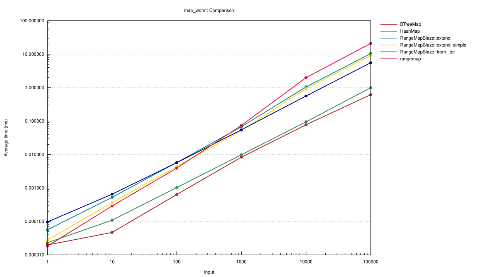
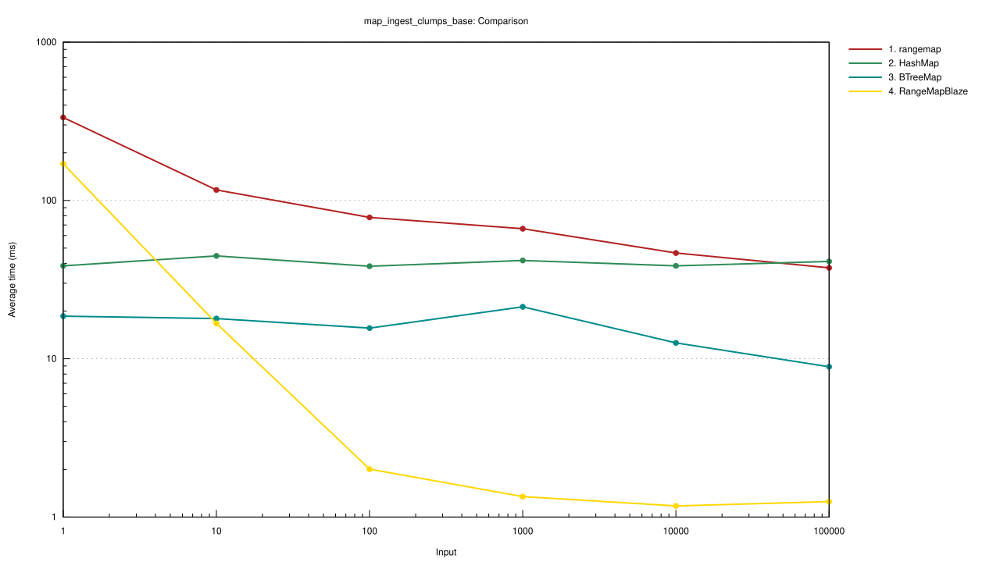
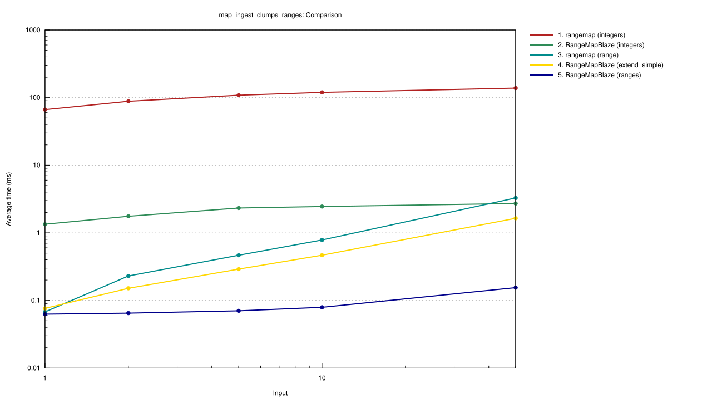
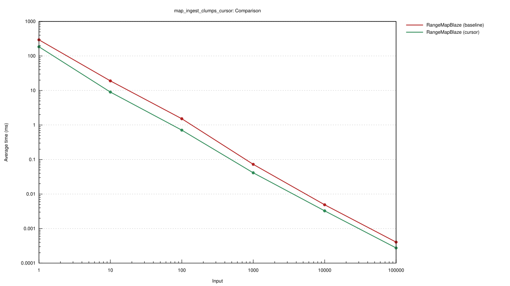
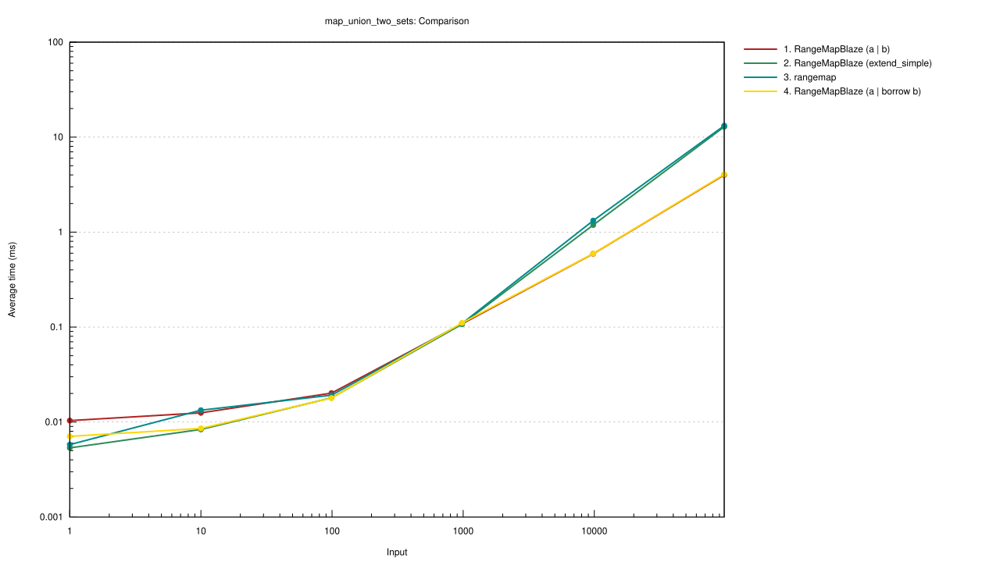
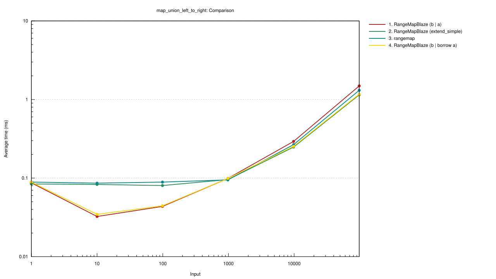
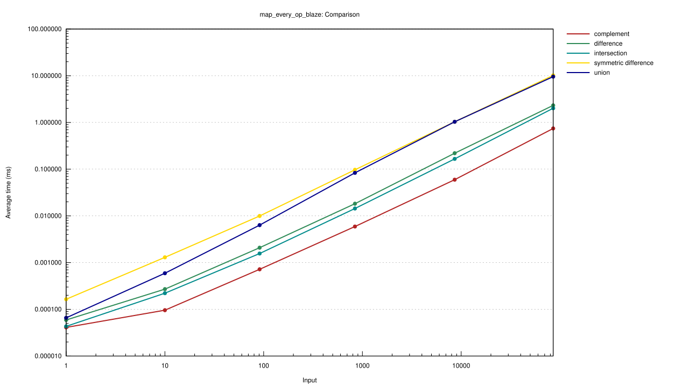
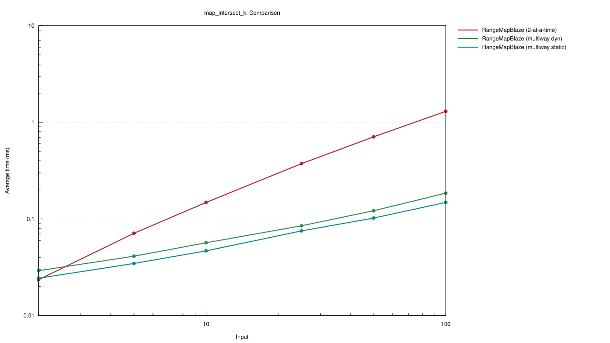

# Benchmarks for (some) Range-Related Rust Crates (Maps only)

*For benchmarks focused on sets, see the [Benchmarks for Range-Related Rust Crates (Sets only)](bench.md) page.*

## Range-Related Rust Crates (Maps only)

Updated: *September 2026*

| Crate | # Downloads (all-time) | Ranges | Element Type | Set Operations? | Internal | Maps, too? |
| --- | --- | --- | --- | --- | --- | --- |
|[range-set-blaze](https://github.com/CarlKCarlK/range-set-blaze) | 5,379,999 | Disjoint | Integer, char, IPv4, IPv6² | Full set ops | BTreeMap | Sets/Maps |
|[rangemap](https://crates.io/crates/rangemap) | 35,175,172 | Disjoint | Ord | No set ops on `RangeMap`¹ | BTreeMap | Sets/Maps |
|[sorted-iter](https://crates.io/crates/sorted-iter) | 773,706 | No | Ord | Full set ops | *n/a* | Sets/Maps |
|[iset](https://crates.io/crates/iset) | 554,439 | Overlapping | PartialOrd | No set algebra | Red Black | Sets/Maps |

> *Download counts are all-time totals from the crates.io API, as of September 2026.*
>
> ¹ Since v1.5.0, `rangemap`'s `RangeSet` type has gained `union`/`intersection` methods (see the [set benchmarks](bench.md) for that comparison), but its `RangeMap` type — the one relevant to this page — still has no set-operation methods.
>
> ² `range-set-blaze` also has experimental floating-point support (`float_experimental` / `float_nightly_experimental` features), not listed above because it is feature-gated and not part of the crate's normal advertised element types.

## Benchmark Selection Criteria

I evaluated:

* `BTreeMap` and `HashMap` from the standard library, and
* `rangemap`, the most popular crate that works with ranges in a tree.

The `rangemap` crate, like this `range-set-blaze` crate, stores disjoint ranges in a `BTreeMap`.
I eliminated crates that store overlapping ranges, a different data structure (for example, `iset`).

Finally, I looked for crates that supported set operations (for example, union, intersection, set difference). None of the remaining crates' map types offered set operations. (The inspirational `sorted-iter` does, but it is designed to work on sorted values, not ranges, and so is not included. `rangemap`'s `RangeSet` type gained `union`/`intersection` as of v1.5.0 — see the [set benchmarks](bench.md) — but that addition did not extend to its `RangeMap` type, so it remains excluded here.)

If I misunderstood any of the crates, please let me know. If you'd like to benchmark a crate, the benchmarking code is in the `benches` directory of this repository.

## Benchmark Results

These benchmarks allow us to understand the `range-set-blaze::RangeMapBlaze` data structure and to compare it to similar data structures from other crates.

## Benchmark #1: 'map_worst': Worst case for RangeMapBlaze

* **Measurement**: Intake (insertion) speed
* **Competitors**: `HashSet`, `BTreeSet`, `rangemap`, `RangeMapBlaze`
* **Variation**: Number of key-value pairs (*n*) from 1 to 10,000
* **Setup**:
  * Randomly and uniformly select *n* keys from 0..=999 (with replacement).
  * Randomly and uniformly select *n* values from 0..=4 (with replacement)

### 'map_worst' Results

`BTreeSet` and `HashSet` are the fastest. `RangeMapBlaze` is consistently around 7 to 10 times slower.
`rangemap` varies from fastest to slowest depending on the number of pairs.

### 'map_worst' Conclusion

`BTreeSet` and `HashSet`, not `RangeMapBlaze` (nor `rangemap`), is a good choices for ingesting sets of non-clumpy integers.

*Lower is better in all plots*


## Benchmark #2: 'map_ingest_clumps_base': Measure `RangeMapBlaze` on increasingly clumpy integer keys

* **Measure**: integer-integer pair intake speed
* **Candidates**: `HashMap`, `BTreeMap`, `rangemap`, `RangeMapBlaze`
* **Vary**: *average clump size* from 1 (no clumps) to 100K (ten big clumps)
* **Details**: We generate 1M integer keys with clumps. We ingest the integer pairs one at a time.
Each clump has size chosen uniformly random from roughly 1 to double *average clump size*. (The integer clumps are positioned random uniform, with-replacement, in a span from 0 to roughly 10M. The exact span is sized so that the union of the 1M integers will cover about 10% of the span. In other words, a given integer key in the span will have a 10% chance of being in one of the 1M integers generated.)

The value for each clump is a random integer from 0 to 4.

### 'map_ingest_clumps_base' Results

With no clumps, `RangeMapBlaze (integers)` is about 9 times slower than `BTreeMap`. Somewhere around clump size 10, `RangeMapBlaze` becomes the best integer performer. As the average clump size goes past 100, `RangeMapBlaze` averages roughly 10 times faster than `BTreeMap`, about 30 times faster than `HashMap`, and roughly 40 times faster than `rangemap (integers)`.

`RangeSetBlaze` batches integer keys with the same value by noticing when consecutive integers fit in a clump. This batching is not implemented in `rangemap` but could easily be added to it or any other range-based crate.

### 'map_ingest_clumps_base' Conclusion

Range-based methods such as `RangeMapBlaze` are a great choice for clumpy integer keys.



## Benchmark #3: 'map_ingest_clumps_ranges': Measure crates on increasingly clumpy ranges keys

* **Measure**: range-integer pair intake speed
* **Candidates**: `rangemap`, `RangeMapBlaze` (ranges, integers, and `extend_simple`)
* **Vary**: *ranges_per_clump* from 1 (ranges are not clumpy) to 50 (ranges are very clumpy).
* **Details**: We generate 1M integer keys in 1000 clumps. We then divide each clump into *ranges_per_clump* overlapping ranges. Each range has the same value.  We ingest the range-value pairs.
Each clump has size chosen uniformly random from roughly 1 to double *average clump size*. (The integer clumps are positioned random uniform, with-replacement, in a span from 0 to roughly 10M. The exact span is sized so that the union of the 1M integers will cover about 10% of the span. In other words, a given integer key in the span will have a 10% chance of being in one of the 1M integers generated.)
Clumps are turned into *ranges_per_clump* overlapping ranges randomly.

The value for each clump is a random integer from 0 to 4.

### 'map_ingest_clumps_ranges' Results

`RangeMapBlaze (ranges)` is the fastest candidate at every `ranges_per_clump` value tested, including when ranges are not clumpy (`ranges_per_clump` = 1) — though there it's only about 8% faster than the next-best candidates (`rangemap (range)` and `RangeMapBlaze::extend_simple`), close enough to be within noise on some runs. As ranges get clumpier, `RangeMapBlaze (ranges)`'s lead grows substantially: at `ranges_per_clump` = 10 it is already about 5.9 times faster than the next best method (`RangeMapBlaze::extend_simple`), and with extremely clumpy ranges (`ranges_per_clump` = 50) it is about 10.6 times faster.

We can also compare ingesting ranges as ranges vs as a sequence of integers. Ingesting as ranges is 17 to 33 times faster than ingesting the same data one integer key at a time (`RangeMapBlaze (integers)`), depending on `ranges_per_clump`.

As before, `RangeSetBlaze` does well because it batches range keys with the same value by noticing when consecutive ranges fit in a clump. This batching is not implemented in `rangemap` but could easily be added to it or any other range-based crate.

### 'map_ingest_clumps_ranges' Conclusion

`RangeMapBlaze` is a great choice for ingesting ranges — it wins even when ranges are not clumpy, and its lead widens quickly as consecutive ranges (with the same value) become more likely to touch or overlap.



## Benchmark #3b: 'map_ingest_clumps_cursor': Experimental B-tree cursor insertion vs. the baseline algorithm

* **Measure**: range-value pair intake speed, inserting one range at a time
* **Candidates**: `RangeMapBlaze` with its normal (baseline) insert algorithm vs. an experimental nightly-only insert algorithm built on Rust's unstable B-tree cursor API (`cursor_nightly_experimental` feature)
* **Vary**: *average clump size* from 1 (no clumps) to 100K (ten big clumps)
* **Details**: Same clump generation as `map_ingest_clumps_base`, with `range_per_clump` = 1. We build a `RangeMapBlaze` by inserting one range-value pair at a time. The baseline algorithm looks up the insertion point and then, separately, mutates the tree. The cursor algorithm does both in a single B-tree traversal using `BTreeMap`'s unstable cursor API (tracked in [rust-lang/rust#107540](https://github.com/rust-lang/rust/issues/107540)). This is the map analog of the [set benchmark of the same idea](bench.md#benchmark-2b-ingest_clumps_cursor-experimental-b-tree-cursor-insertion-vs-the-baseline-algorithm) — `RangeMapBlaze::internal_add_cursor` already existed in the source but, until now, wasn't wired up for benchmarking (the supporting `test_util` helpers and cfg gates were added alongside this benchmark).

The cursor algorithm requires a nightly compiler. Both candidates run in the same process, via `range_set_blaze::test_util::{map_insert_baseline, map_insert_cursor}`, so they land in one plot from a single invocation:

```sh
cargo +nightly bench --bench bench_map --features cursor_nightly_experimental,test_util -- map_ingest_clumps_cursor
```

### 'map_ingest_clumps_cursor' Results

The cursor algorithm is faster than the baseline at every clump size tested, by roughly 1.5× to 2.1× (geometric mean about 1.7×):

| average clump size | baseline | cursor | speedup |
| ---: | ---: | ---: | ---: |
| 1 | 294 ms | 185 ms | 1.6× |
| 10 | 19.0 ms | 9.00 ms | 2.1× |
| 100 | 1.52 ms | 710 µs | 2.1× |
| 1,000 | 72.7 µs | 41.3 µs | 1.8× |
| 10,000 | 4.89 µs | 3.27 µs | 1.5× |
| 100,000 | 406 ns | 275 ns | 1.5× |

As with the set version of this benchmark, the speedup is roughly constant across clump sizes — the cursor algorithm saves a redundant tree traversal on every insert, a fixed-fraction win regardless of how many elements each clump merges. The map version's speedup runs somewhat lower than the set version's (geometric mean ≈1.7× vs. ≈2.0×), which is expected: the map's cursor and baseline algorithms both do extra per-insert work (tracking and merging values, not just ranges) that dilutes the fraction of time spent on the redundant tree traversal that the cursor API eliminates.

**Isolating the compiler from the algorithm.** We separately compiled and ran just the baseline candidate under the normal **stable** toolchain (`cargo bench --bench bench_map -- map_ingest_clumps_cursor`, no `cursor_nightly_experimental` feature):

| average clump size | baseline (stable) | baseline (nightly) | cursor (nightly) | speedup, cursor vs. stable baseline |
| ---: | ---: | ---: | ---: | ---: |
| 1 | 285 ms | 294 ms | 185 ms | 1.5× |
| 10 | 18.5 ms | 19.0 ms | 9.00 ms | 2.1× |
| 100 | 1.48 ms | 1.52 ms | 710 µs | 2.1× |
| 1,000 | 71.3 µs | 72.7 µs | 41.3 µs | 1.7× |
| 10,000 | 4.65 µs | 4.89 µs | 3.27 µs | 1.4× |
| 100,000 | 387 ns | 406 ns | 275 ns | 1.4× |

The stable-compiled baseline is close to the nightly-compiled baseline at every clump size (nightly is consistently about 2%–5% slower, never faster), and the cursor-vs-stable-baseline speedup (geometric mean ≈1.7×) is essentially the same as the cursor-vs-nightly-baseline speedup reported above (≈1.7×). This confirms the speedup is coming from the cursor algorithm itself, not from nightly codegen.

### 'map_ingest_clumps_cursor' Conclusion

Like the set version, the B-tree cursor insertion algorithm is a consistent, unconditional win over the baseline for single-range inserts into `RangeMapBlaze`. It is still experimental and nightly-only pending stabilization of the cursor API, but the results support the direction.



## Benchmark #4: 'map_union_two_sets': Union two maps with clumpy integer keys

* **Measure**: adding a map to an existing map
* **Candidates**: `RangeMapBlaze` (owned `|`, borrowed-rhs `|`, `extend_simple`) and `rangemap`
* **Vary**: Number of clumps in the second map, from 1 to about 100K.
* **Details**: We first create two clump iterators, each with the desired number of clumps. Their integer span is 0..=99_999_999.
Each clump iterator is designed to cover about 10% of this span. We, next, turn these two iterators into two maps. The first map is made from 1000 clumps.
Finally, we measure the time it takes to add the second map to the first map.

The value for each clump is a random integer from 0 to 4.

### `map_union_two_sets` Results

A September 2026 re-run turned up a real change from the previous write-up below, not just numeric drift. The main finding: the owned-owned union is *not* uniformly "fast across all input sizes" the way the old text claimed — in the left-precedence direction it is the *slowest* `RangeMapBlaze` candidate once the second map is large. This traces to a real asymmetry in the implementation (`src/map.rs`): when one map is much bigger than the other, the union either computes a cheap set-difference and batch-extends it into the big map (when the big map's values win), or individually re-inserts every entry of the small map into the big one (when the small map's values win, which can require restructuring existing ranges) — the latter is inherently more work. The borrowed-vs-owned union comparison specifically is less clear-cut: we've seen results go either way between runs and candidates, close enough that we treat the two as roughly on par rather than draw a directional conclusion. Numbers below are mean times (n = number of clumps in the second, growing map).

#### When the second map's values take precedence (`a | b`, `map_union_two_sets`)

| n | owned (`a \| b`) | borrowed (`a \| &b`) | `extend_simple` | `rangemap` |
| ---: | ---: | ---: | ---: | ---: |
| 1 | 10.4 µs | 7.1 µs | 5.3 µs | 5.8 µs |
| 10 | 12.5 µs | 8.6 µs | 8.4 µs | 13.3 µs |
| 99 | 20.2 µs | 17.9 µs | 18.0 µs | 19.2 µs |
| 980 | 108.2 µs | 110.6 µs | 107.2 µs | 109.2 µs |
| 9,809 | 591.6 µs | 594.0 µs | 1.19 ms | 1.32 ms |
| 97,863 | 4.00 ms | 4.05 ms | 12.86 ms | 13.21 ms |

`rangemap` and `RangeMapBlaze::extend_simple` are the fastest candidates while the second map is small (up to n ≈ 100), but their performance degrades as the second map grows larger — by about n = 9,809 they are roughly 2× slower than the owned or borrowed union operator, growing to about 3.2× slower at n ≈ 100,000.

The owned-owned and borrowed-rhs union operators track each other closely at every size (within about 5% of each other from n = 99 up, and both within a factor of 2 even at the smallest sizes), and together are the best or near-best choice across the whole range. Borrowing an operand here does not carry the roughly-20%-slower penalty the previous write-up described.

#### When the first map's values take precedence (`b | a`, `map_union_left_to_right`)

| n | owned (`b \| a`) | borrowed (`b \| &a`) | `extend_simple` | `rangemap` |
| ---: | ---: | ---: | ---: | ---: |
| 1 | 87.0 µs | 89.0 µs | 84.3 µs | 89.0 µs |
| 10 | 32.5 µs | 34.6 µs | 83.0 µs | 86.2 µs |
| 99 | 43.6 µs | 44.5 µs | 80.4 µs | 89.0 µs |
| 980 | 99.1 µs | 99.1 µs | 95.8 µs | 94.9 µs |
| 9,809 | 293.1 µs | 253.8 µs | 248.3 µs | 266.8 µs |
| 97,863 | 1.49 ms | 1.17 ms | 1.15 ms | 1.31 ms |

`rangemap` and `RangeMapBlaze::extend_simple` are up to about 2.6× slower than the union operators for mid-sized second maps (n ≈ 10–99), consistent with the old write-up's "up to 2.5× slower for small inputs." But at the largest size tested (n ≈ 97,863), the story flips: owned-owned union is now the *slowest* candidate overall, roughly 25–30% slower than `extend_simple`, `rangemap`, and the borrowed-rhs union (which are all within about 15% of each other) — the opposite of "the owned-operand union is again fast across all input sizes." That gap is explained by the algorithmic asymmetry described above, not by anything specific to borrowing.

### `map_union_two_sets` Conclusion

The union operator (owned or borrowed — the two are close enough to treat as interchangeable) is the best general-purpose choice across most sizes and both precedence directions. The one caveat: in the left-precedence direction with a large second map (the first map's values win, second map is large), the owned-owned union is the slowest option — `extend_simple` or a borrowed-rhs union is worth using instead there.

If `extend_simple` or `rangemap` fits your use case — a small-to-medium second map — they remain reasonable alternatives, though the union operator is no longer clearly worse for that case as previously described.

**Right Precedence:**  


**Left Precedence:**


## Benchmark #5: 'map_every_op_blaze': Compare `RangeMapBlaze`'s set operations to each other on clumpy data

* **Measure**: set operation speed
* **Candidates**: union, intersection, difference, symmetric_difference, complement
* **Vary**: number of ranges in the map, from 1 to about 100K.
* **Details**: We create two clump iterators, each with the desired number of clumps and a coverage of 0.5. Their span is 0..=99_999_999. We, next, turn these two iterators into two maps. Finally, we measure the time it takes to operate on the two maps.

### 'map_every_op_blaze' `RangeMapBlaze` Results and Conclusion

Complement (which works on just one map) is roughly two to three times faster than intersection and difference (once past the smallest input size). Symmetric difference is the slowest operation, roughly 4 to 7 times slower than intersection. For small inputs, Union is similar to intersection and difference, but as the input size grows it also slows down, peaking at around 6 times slower than intersection before narrowing slightly at the largest size tested.



## Benchmark #6: 'map_intersect_k': `RangeMapBlaze` ` Multiway vs 2-at-time intersection

* **Measure**: intersection speed
* **Candidates**: 2-at-a-time intersection, multiway intersection (static and dynamic)
* **Vary**: number of maps, from 2 to 100.
* **Details**: We create *n* iterators. Each iterator generates 1,000 clumps. The iterators are designed such that the coverage of the final intersection is about 25%. The span of integers in the clumps is 0..=99_999_999. We turn the *n* iterators into *n* maps. Finally, we measure the time it takes to operate on the *n* maps.

### 'map_intersect_k' Results and Conclusion

On two maps, two-at-a-time is slightly faster, but beyond that it gets slower and slower relative to multiway. For 100 maps, it must create about 100 intermediate maps and is about 8.8 times slower than static multiway.

Dynamic multiway is not used by `RangeMapBlaze` but is sometimes needed by `SortedDisjoint` iterators
(also available from the `range-set-blaze` crate). It is roughly 13% to 25% slower than static multiway across the sizes tested (averaging around 20%).


