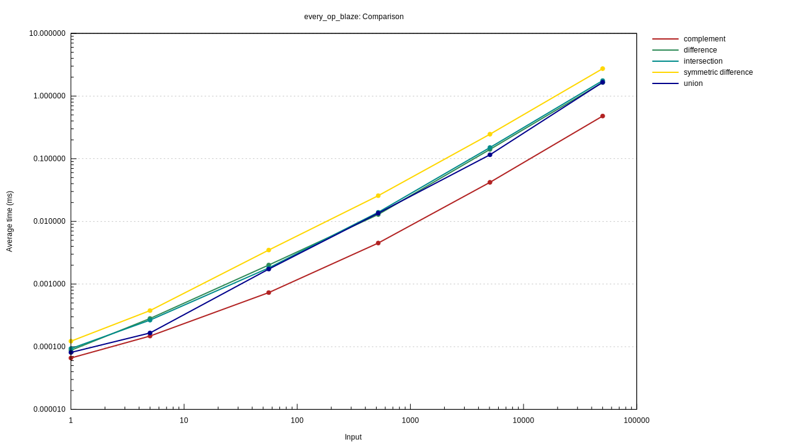
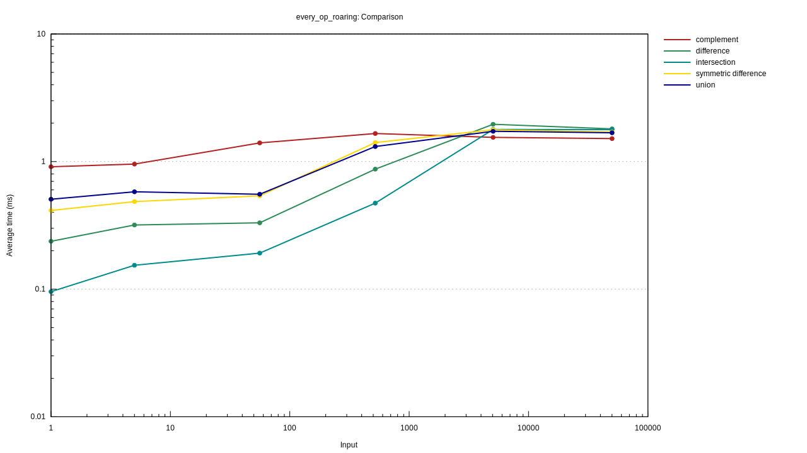
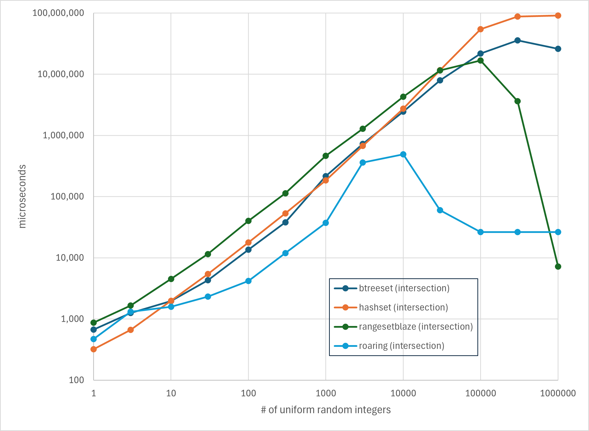

# Benchmarks for (some) Range-Related Rust Crates (Maps only)

## Range-Related Rust Crates (Maps only)

Updated: *April 2025*

| Crate | # Downloads | Ranges | Element Type | Set Operations? | Internal | Maps, too? |
| --- | --- | --- | --- | --- | --- | --- |
|[range-set-blaze](https://github.com/CarlKCarlK/range-set-blaze) |  603,680 | Disjoint | Integer, char, IPv4, IPv6 | Set Ops | BTreeMap | Sets/Maps |
|[rangemap](https://crates.io/crates/rangemap) | 5,285,903 | Disjoint | Ord | No Set Ops | BTreeMap | Sets/Maps |
|[sorted-iter](https://crates.io/crates/sorted-iter) | 326,742 | No | Ord | Set Ops | *n/a* | Sets/Maps |
|[iset](https://crates.io/crates/iset) | 333,454 | Overlapping | PartialOrd | No Set Ops | Red Black | Sets/Maps |

> *The # of downloads as of April 2025*

## Benchmark Selection Criteria

I started by evaluating:

* `BTreeMap` and `HashMap` from the standard library
* `rangemap`, the most popular crate that works with ranges in a tree

I later added:

The `rangemap` crate stores disjoint ranges. I eliminated crates that store overlapping ranges, a different data structure (for example, `iset`).

Finally, I looked for crates that supported set operations (for example, union, intersection, set difference). None of the remaining crates offered tested set operations. (The inspirational `sorted-iter` also does, but it is designed to work on sorted values, not ranges, and so is not included.)

If I misunderstood any of the crates, please let me know. If you'd like to benchmark a crate, the benchmarking code is in the `benches` directory of this repository.

## Benchmark Results

These benchmarks allow us to understand the `range-set-blaze::RangeMapBlaze` data structure and to compare it to similar data structures from other crates.

## Benchmark #1: 'map_worst': Worst case for RangeMapBlaze

* **Measurement**: Intake (insertion) speed
* **Competitors**: `HashSet`, `BTreeSet`, `rangemap`, `RangeMapBlaze`
* **Variation**: Number of key-value pairs (*n*) from 1 to 10,000
* **Setup**:
  * Randomly and uniformly select *n* keys from 0..=999 (with replacement).
  * Randomly and uniformly select *n* values from 0..=4 (with replacement)

### 'map_worst' Results

`RangeMapBlaze` is consistently around 7 to 10 times slower than `BTreeSet` and `HashSet`. `rangemap` varies from fastest to slowest depending on the number of pairs.

### 'map_worst' Conclusion

`BTreeSet` or `HashSet`, not `RangeMapBlaze` (nor `rangemap`), is a good choice for ingesting sets of non-clumpy integers. However, `RangeMapBlaze` is consistently an average 10 times worse.

> See benchmark ['map_worst_op_blaze'](#benchmark-9-worst_op_blaze-compare-roaring-and-rangesetblaze-operators-on-uniform-data), near the end, for a similar comparison of set operations on uniform data.

*Lower is better*

## Benchmark #2: 'map_ingest_clumps_base': Measure `RangeMapBlaze` on increasingly clumpy integer keys

* **Measure**: integer-integer pair intake speed
* **Candidates**: `HashSet`, `BTreeSet`, `rangemap`, `RangeMapBlaze`
* **Vary**: *average clump size* from 1 (no clumps) to 100K (ten big clumps)
* **Details**: We generate 1M integer keys with clumps. We ingest the integer pairs one at a time.
Each clump has size chosen uniformly random from roughly 1 to double *average clump size*. (The integer clumps are positioned random uniform, with-replacement, in a span from 0 to roughly 10M. The exact span is sized so that the union of the 1M integers will cover about 10% of the span. In other words, a given integer key in the span will have a 10% chance of being in one of the 1M integers generated.)

Where applicable, we also test ingesting range-integer pairs.

### 'map_ingest_clumps_base' Results

With no clumps, `RangeMapBlaze` is 7 times slower than `BTreeMap`. Somewhere around clump size 5, `RangeMapBlaze` becomes the best performer. As the average clump size goes past 100, `RangeMapBlaze` averages about 10 times faster than `HashSet` and `BTreeSet`, and roughly 30 times faster than `rangemap (integers)`.

If we are allowed to input the clumps as range-integer pairs (instead of integer-integer pairs), then when the average clump size is 1000 `RangeMapBlaze` roughly 300
times faster than `HashSet` and `BTreeSet`. However, note that `rangemap (range)` is faster still

### ingest_clumps_base' Conclusion

Range-based methods such as `RangeMapBlaze` and `rangemap` are a great choice for clumpy integers. When the input is given as ranges, they are the only sensible choice. `RangeMapBlaze` is the better choice when the keys are integers. `rangemap` may be faster when the keys come in as ranges.

## Benchmark #6: 'union_two_sets': Union two sets of clumpy integers

* **Measure**: adding ranges to an existing set
* **Candidates**: RangeSetBlaze, rangemap, Roaring
* **Vary**: Number of clumps in the second set, from 1 to about 90K.
* **Details**: We first create two clump iterators, each with the desired number of clumps. Their integer span is 0..=99_999_999.
Each clump iterator is designed to cover about 10% of this span. We, next, turn these two iterators into two sets. The first set is made from 1000 clumps. Finally, we measure the time it takes to add the second set to the first set.

`RangeMapBlaze` uses a hybrid algorithm for "union". When adding a few ranges, it adds them one at a time. When adding many ranges, it
merges the two sets of ranges by iterating over them in sorted order and merging.

### 'union_two_sets' Results

When adding one clump to the first set, `RangeMapBlaze` is about 40% faster than `rangemap` and 50 times faster than `Roaring`.

As the number-of-clumps-to-add grows, `RangeMapBlaze` automatically switches algorithms. This allows it to be 6 times faster than the `rangemap`. `Roaring` and `RangeMapBlaze` use very similar `union` algorithms when the number of clumps is large and get similar results.

### union_two_sets' Conclusion

Over the whole range of clumpiness, `RangeMapBlaze` is faster because it uses a hybrid algorithm.

## Benchmark #7a: 'every_op_blaze': Compare `RangeMapBlaze`'s set operations to each other on clumpy data

* **Measure**: set operation speed
* **Candidates**: union, intersection, difference, symmetric_difference, complement
* **Vary**: number of ranges in the set, from 1 to about 50K.
* **Details**: We create two clump iterators, each with the desired number of clumps and a coverage of 0.5. Their span is 0..=99_999_999. We, next, turn these two iterators into two sets. Finally, we measure the time it takes to operate on the two sets.

### 'every_op_blaze' `RangeMapBlaze` Results and Conclusion

Complement (which works on just once set) is twice as fast as union, intersection, and difference. Symmetric difference is 1.7 times slower.

## Benchmark #7b: 'every_op_roaring': Compare `Roaring`'s set operations to each other on clumpy data

* *Set up same as in #7a*

### 'every_op_roaring' `Roaring` Results and Conclusion

Intersection is much faster than union. Complement is slowest because it is not defined by `Roaring` but can be defined by the user as `Universe - a_set`.

## Benchmark #7c: 'every_op': Compare `RangeSetBlaze and`Roaring`'s set operations on clumpy data

* *Set up same as in #7a*

### 'every_op' `RangeMapBlaze` and `Roaring` Results and Conclusion

When the number of ranges (or clumps) is very small, `RangeMapBlaze` operates on the data 1000's of times faster than `Roaring`. As the number of clumps goes into the 100's and 1000's, it is still 10 to 30 times faster. When the number of ranges get even larger, it is slightly faster.

The plot shows the results for intersection, `Roaring`'s fastest operator on this data.

> See benchmark ['worst_op_blaze'](#benchmark-9-worst_op_blaze-compare-roaring-and-rangesetblaze-operators-on-uniform-data), near the end, for a similar comparison of set operations on uniform data.

## Benchmark #8: 'intersect_k_sets': `RangeMapBlaze` ` Multiway vs 2-at-time intersection

* **Measure**: intersection speed
* **Candidates**: 2-at-a-time intersection, multiway intersection (static and dynamic)
* **Vary**: number of sets, from 2 to 100.
* **Details**: We create *n* iterators. Each iterator generates 1,000 clumps. The iterators are designed such that the coverage of the final intersection is about 25%. The span of integers in the clumps is 0..=99_999_999. We turn the *n* iterators into *n* sets. Finally, we measure the time it takes to operate on the *n* sets.

### 'intersect_k_sets' Results and Conclusion

On two sets, all methods are similar but beyond that two-at-a-time gets slower and slower. For 100 sets, it must create about 100 intermediate sets and is about 10 times slower than multiway.

Dynamic multiway is not used by `RangeMapBlaze` but is sometimes needed by `SortedDisjoint` iterators
(also available from the `range-set-blaze` crate). It is 40% slower than static multiway.

## Benchmark #9: 'worst_op_blaze': Compare `Roaring` and `RangeMapBlaze` operators on uniform data

* **Measure**: set intersection speed
* **Candidates**: `BTreeSet`, `HashSet`, `Roaring`, `RangeMapBlaze`
* **Vary**: *n* from 1 to 1M, number of random integers
* **Details**: Select *n* integers randomly and uniformly from the range 0..100,000 (with replacement). Create 20 pairs of set at each length.

### 'worst_op_blaze' Results and Conclusion

Over almost the whole range `Roaring` is best. Roughly 10 times better than `RangeMapBlaze` when the number of integers is less than 10,000. As the number of integers increases beyond 10,000 `RangeMapBlaze`, `BTreeSet`, and `HashSet` continue to get slower. `Roaring`, on the other hand, gets faster; presumably as it switches to bitmaps.

`Roaring` is a great choice when doing operations on u64 sets that may or may not be clumpy.

All four candidates offer similar interfaces. If you're not sure which is best for your application, you can easily swap between them and see.

